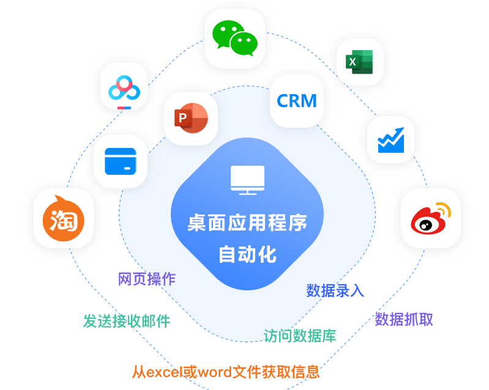
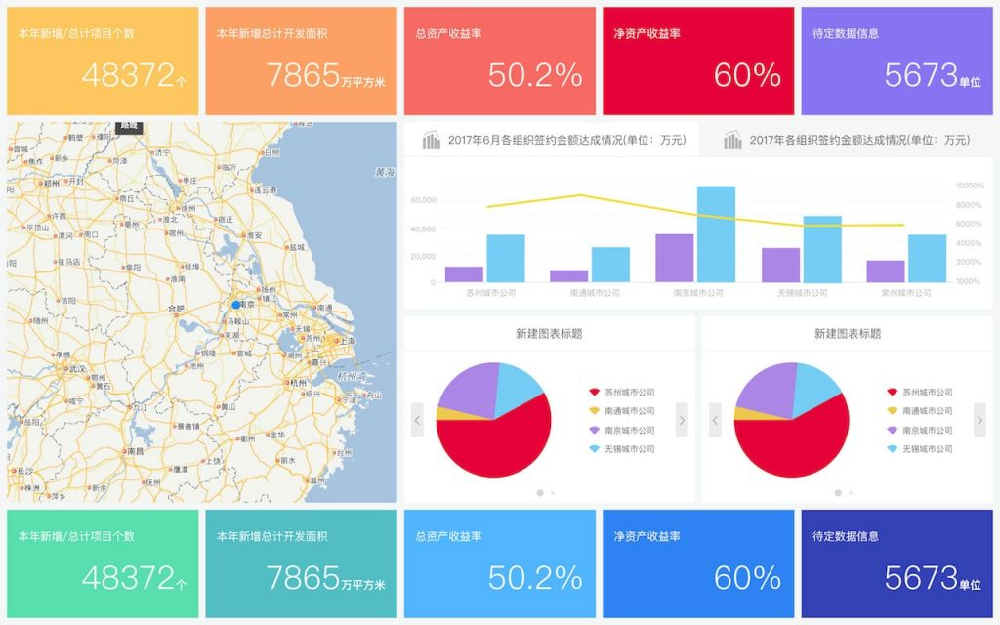
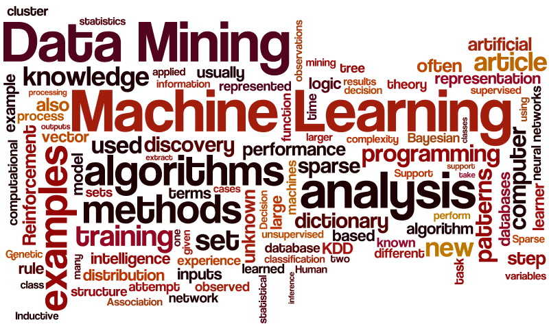

{ align=right width=500 }

### **流程自动化**

开发机器人流程自动化（RPA），来完成一系列需要手动完成的任务，代替、辅助人类完成相关的计算机操作。

RPA 结合了软件 API 和用户界面 (UI) 交互，在企业和生产力应用程序之间集成和执行重复性任务。通过部署模拟人类流程的脚本，RPA 工具在不相关的软件系统中自主执行各种活动和事务。这种形式的自动化使用基于规则的软件执行大量业务流程活动，从而使人力资源腾出时间优先处理更复杂的任务。

[:octicons-arrow-right-24: 查看更多](rpa/index.md)

 
 

{ align=left width=500 }

### **管理驾驶舱**

通过整合来自多个数据源的信息，与业务人员与管理人员协作建立全面的指标体系。这一体系不仅评估业务绩效，还能深入洞察运营效率。利用先进的数据可视化工具，我们将复杂的数据转化为直观的实时监控看板和定期报告。这些工具使团队能够快速识别关键趋势和潜在问题，促进高效决策。同时，自动化的数据处理流程确保数据的准确性和一致性，增强了分析的深度和广度，使企业在动态环境中保持竞争优势。

[:octicons-arrow-right-24: 查看更多](kpi/index.md)

 
 

{ align=right width=500 }

### **数据分析预测**

开展深入的数据分析和挖掘工作，揭示数据之间的内在关联。基于业务场景，尝试进行归因分析，找出影响业务的关键因素，形成有效的运营策略。同时，运用机器学习与建模技术，构建预测模型，帮助识别潜在趋势和行为。通过持续积累和监控运营过程中的数据，评估策略的效果，及时调整和优化，逐步实现最优的业务结果。

[:octicons-arrow-right-24: 查看更多](kpi/analysis.md)

