数据报表和数据看板通常包含大量指标，指望一次性看清所有问题并不现实。因此，建议按照以下步骤逐步进行分析：

<figure markdown="span">
  { width="1024" }
</figure>

1. **静态观察一个业务的关键指标**：首先，关注业务中的一个核心指标，建立对业务的初步认识。例如，本月的整体销售收入是多少？这有助于形成对当前业务状况的基本理解。

2. **动态观察该关键指标的变化趋势**：接下来，分析该指标在一段时间内的动态变化。例如，查看今年1月到现在每个月的销售收入，并与去年同期进行对比。通过趋势分析，掌握指标的规律性变化。

3. **细化观察关键指标的子指标**：深入分析指标构成，了解其细节。例如，整体销售收入是由哪些门店贡献的？各门店的比例如何？这些比例是否发生了变化？进一步探讨有哪些店铺业绩下滑（问题点），哪些店铺表现突出（机会点）。这一步帮助你深入理解指标背后的业务动态。

4. **关联分析另一个关键指标**：在掌握了一个核心指标的基础上，再引入另一个关键指标进行对比。例如，结合整体销售收入与成本，分析成本与收入的关系，了解业务的盈利情况。

5. **跨业务对比分析**：最后，将两个业务的关键指标进行对比，找出各自的特点与差异。通过对比，不同业务的优劣势就能更清晰地展现出来。

按此顺序，从简单到复杂、由浅入深，逐步展开分析。每一步都能得出明确的结论，避免因数据复杂性而陷入分析困境。

具体的分析方式可以总结为下图，以下我们将一一介绍。

<figure markdown="span">
  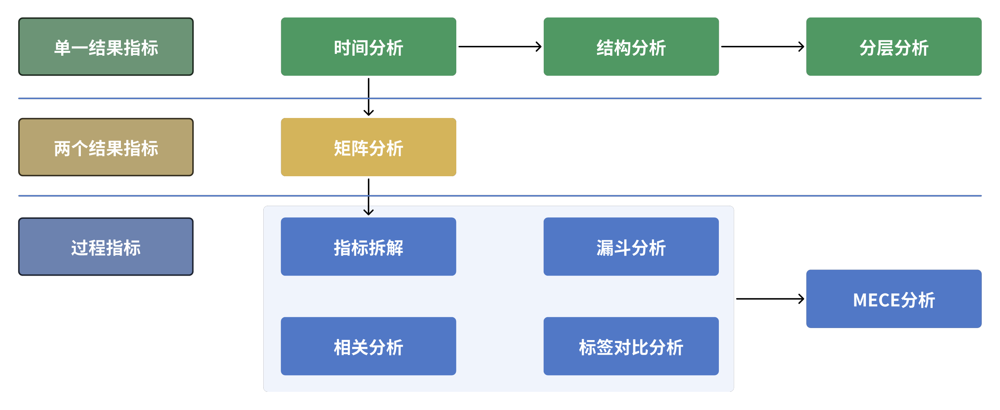{ width="1024" }
</figure>

## 时间分析法

通过分析一段时间内指标的连续变化趋势，来描述业务发展的状况，并总结出发展规律的方式，称为时间分析法。在分析连续数据时，不能孤立地看待单个时间点的数据，而是要将其作为整体趋势的一部分进行观察。通过这种整体视角，可以建立评判标准，判断指标的波动是否属于正常现象。如果出现异常波动，还需要结合指标的具体含义，分析这种波动对业务是有利还是不利。

时间分析法可以细分为以下五种具体方法：

### 趋势分析法

趋势分析法是指通过分析某个指标在连续时间内的变化趋势，来判断业务走向的分析方法。以“月总销售收入”为例，按月统计时，商业机构的收入通常呈现三种基本形态：

<figure markdown="span">
  { width="800" }
</figure>

- 稳定型走势：每个月的收入固定。
- 增长型走势：每个月的收入都比前一个月高。
- 衰退型走势：每个月的收入都比前一个月低。

这三种走势中，判断好坏的标准通常很直观：

- 增长型 ≥ 稳定型。
- 稳定型 ≥ 衰退型。

为了量化这种波动，人们引入了 **环比** 的概念，用来衡量某一期数据相较于上一期的变化幅度。环比的计算公式为：`环比=当期数据÷上一期数据-1`。

当然，增长趋势并非总是线性的，即使整体趋势是增长，也可能偶尔出现数据下跌。因此，通常以月度、季度或半年为周期来审视增长趋势。一般来说，只要连续3期环比增长，就可以认为“呈现上涨走势”。走势结束要么以观察期结束为准，要么以连续出现3次增长停滞（不变或下跌）而宣告结束。如图所示，虽然一年内有3个月是环比下跌的，但其他月份都在上涨，因此还是会说年度呈现增长态势。

<figure markdown="span">
  { width="800" }
</figure>

当连续3期环比下跌时，则称为“下跌走势”。走势的终止可以以观察期结束为准，也可以通过连续3期不再下跌（出现上涨或平稳）来判定走势结束。

在商业运营中，很多行业会受到经济周期或政策环境的影响，出现显著的长期波动。因此，通过趋势分析可以有效判断以下情况：

- 当前是否进入上升或下跌周期。
- 如果已进入某一周期，预估其可能的利好或利空影响。
- 在最优或最差的情况下，当月可能剩余多少资金。

这种分析可以帮助企业提前预判，并做好相应的资源准备。

虽然在视觉上，人们更容易接受上升的趋势，期待收入越涨越高，看到下跌则容易引发担忧。然而，对于“产出”类的结果性指标，不应简单地认为“越高越好，越低越差”。实际业务中，还可能出现以下几种情况：

- 波动属于自然变化，例如淡旺季交替或大小年轮替。
- 波动源于产品或业务生命周期的自然结束。
- 波动是企业内部有计划的行动，带来的预期结果。

因此，不能仅凭直觉判断波动的好坏。除了识别大环境带来的增长或下跌趋势外，还需要结合自然周期、产品生命周期和内部主动行为等因素，才能做出更为准确的判断。

### 自然周期分析法

许多商业模式会随着季节或时间的变化而产生自然波动。例如，在B2C零售、服务、餐饮娱乐等行业，通常周末或节假日的生意会比工作日更好。这种趋势在销售收入上表现为：工作日收入较低，而周末收入较高。

然而，对于B2B或B2B2C类企业，情况则有所不同。像批发、商贸、对公服务等行业，工作日才是商讨、谈判、签约、施工、验收、付款的高峰期，而周末通常是休息日。相应地，收入表现为：工作日较高，周末较低。

<figure markdown="span">
  { width="800" }
</figure>

掌握了这些基本的规律后，在观察数据走势时就能避免不必要的担忧。比如，在下图左侧的例子中，虽然第二周的周一到周三销售收入似乎出现了显著下滑，但由于工作日本来就是淡季，而到了周五销售迅速回升，说明这种波动是正常的，可能只是偶然波动。而在下图右侧的例子中，尽管是周五，但销售收入并未如预期反弹，且周末的收入也低于前一周，这就表明有潜在问题，需要进一步调查。

<figure markdown="span">
  { width="800" }
</figure>

按月度观察，也会发现类似规律。例如：

- 公历2月常遇到春节，很多公司到农历正月十五后才恢复正常运营。
- 公历4月和5月有清明节和劳动节，农历八月（公历9月左右）有中秋节，公历10月有国庆节。
- 公历12月临近元旦，一些外企会在圣诞节期间放假。

这些节假日会引发收入数据的自然波动：

- 普通消费者的消费行为在节假日得到释放。
- B2B企业则需要在假日前完成验收、付款和签约。

还有一些自然波动是季节性的，因为许多业务受季节需求影响，例如：

- 冬季：保暖服饰、白酒、暖手宝、电热毯、厚被子销量上升。
- 夏季：饮料、啤酒、冰箱、电风扇成为热销产品。
- 春秋季：旅游、户外运动等活动更加频繁。

季节与天气往往相互作用，形成区域性的特色需求。例如，华中地区冬季没有集中供暖，因此保温产品的销量比北方更高。而商家通常会提前数月备货，导致收入数据提前反映季节性需求变化。特殊的天气条件，例如过冷或过热的年份，也会影响销售趋势，造成月度波动差异。以口罩为例，疫情前的口罩销售高峰通常在冬季和春季，因为这些季节呼吸系统疾病高发，销售曲线可能如图所示。

<figure markdown="span">
  { width="800" }
</figure>

在观察销售数据指标时，结合时间维度与商业模式，分析每周（区分工作日/周末）、每月（节假日/非节假日）、一年四季等的波动，可以发现自然周期规律。当指标的波动符合这种规律时，一般不必过于担心，首先观察它是否在过去的波动范围内。如果在范围内，说明一切正常；如果超出或逆周期波动，则说明可能出现问题，需要特别关注。

当然，并非所有波动都归因于自然周期，有些属于业务自身的“生命周期规律”，这也是需要注意的部分。

### 生命周期分析法 {#生命周期分析法}

很少有商业模式能够保证企业始终处于持续增长状态。用户需求会变化，技术会革新，市场竞争也会加剧，因此每种商业模式都有其增长极限，之后往往会进入衰退期。这种变化趋势被称为“生命周期走势”。需要注意的是，生命周期的计算并不是按照自然时间来统计的，而是从产品或业务上线的时间点开始，按月计算。

典型的生命周期走势在科技类产品中尤为明显，例如手机、电脑、平板等。即使这些产品在发布时设计前卫、功能强大，但随着竞争对手快速推出类似产品和新技术的出现，用户很快会转向更新的产品，导致生命周期的表现特别显著。类似的还有女性服装，由于季节性和潮流的变化，生命周期更短，通常一款新品的热销期只有6到8周。

<figure markdown="span">
  { width="800" }
</figure>

生命周期通常分为以下四个阶段：

- **预热期**：新品刚推出时，市场接受度较低，处于宣传期，销量不高。
- **成长期**：市场逐渐接受，销售量开始大幅增长，产品铺货加速。
- **稳定期**：销售量达到顶峰，随后进入小幅回落阶段。
- **衰退期**：销量显著下滑，企业开始筹备新产品的推出。

在不同阶段，可以分别统计每个阶段的收入，也可以统计从产品上市到退市整个生命周期的收入（即LTV，Life Time Value，生命周期价值）。对生命周期曲线的分析具有重要意义：

<figure markdown="span">
  { width="800" }
</figure>

1. **识别波动性质**：有助于区分规律性波动和非规律性波动。
2. **业务状态判断**：可以帮助判断当前业务处于哪个发展阶段，从而制定相应策略。
3. **新业务决策参考**：为未来业务选择提供参考，预估新业务的生命周期价值。

在以生命周期曲线作为判断依据时，可以采用以下三种方法：

1. **单业务评价**：成长期冲得越高、稳定期越长、LTV越大越好。针对具体业务时，这是一种简单的衡量标准。
2. **标杆对比**：当有标杆产品作为参考时，新的业务发展趋势越接近标杆，说明新品表现越好，偏离标杆则表明可能存在问题。
3. **收入预警**：当产品收入走势出现变化时，及时发出预警。例如，通过对比标杆产品的走势，当现有产品收入连续下降时，可以根据其生命周期的阶段判断是否进入衰退期或是否只是稳定期的短期波动，从而采取相应措施。

参考的预警标准如下：

- **拐点1**：销售收入环比大幅增长（10%以上），且连续两次以上。预警：可能进入成长期。
- **拐点2**：销售收入环比增速放缓（5%以内），并出现环比负增长。预警：可能进入稳定期。
- **拐点3**：销售收入环比连续两次以上负增长。预警：可能进入衰退期。

当出现这些预警时，可以进一步监测趋势或使用更多分析手段确认问题，以便及时调整策略。生命周期分析法虽然不是唯一的判断标准，但它是一个非常敏感且有效的监测工具。

<figure markdown="span">
  { width="800" }
</figure>

需要注意的是，除了生命周期，主动行为也会影响收入表现。某些主动行为甚至可能改变生命周期或自然周期的形态，因此在分析时也需要关注这些因素的影响。

### 主动行为分析法

企业主动开展的商业行为会改变收入指标的形态。典型的如“双11”，在2009年以前，11月11日只是一个普通的日子。自从大型电商平台开始集中在11月11日进行大促销以后，“双11”作为购物节的观念便深入人心。很多公司的收入曲线，会在11月有明显暴涨，同样还有“双12”“6.18”等“人造节日”。某公司11月的销售收入走势，如图所示。

<figure markdown="span">
  { width="800" }
</figure>

以促销活动为例，促销活动前后，经常有这5个阶段。

- 宣传期：活动宣传开始，投机的用户开始停止消费，等待活动，总销售收入下降。
- 上线期：活动刚上线，参与的人数最多，销售收入冲得最高。
- 持续期：活动持续，陆续有人参与，销售收入低于巅峰，但仍高于平均水平。
- 结束期：活动结束后，大量用户提前透支了消费，导致销售收入短暂下跌。
- 恢复正常：活动影响已消失，用户按正常水平购买。

通过记录业务方的行为，可以配合销售收入曲线，识别出这些动作的影响点与影响力度。从而辨识重大活动的效果。并且，不同力度的活动，销售收入曲线形态也会有差异，单纯地通过销售收入曲线变化，也能识别出哪些活动效果明显，哪些活动不温不火。

<figure markdown="span">
  { width="800" }
</figure>

企业的主动行为可能对企业的销售有正向和负向两种影响。

- 带来正向影响的行为
    - 新品上市
    - 新店开业
    - 促销、优惠活动
    - 主动拓展用户
    - 主动清仓
  
这些都会给收入曲线带来额外的增长动力，带来收入曲线的正波动。

- 带来负向影响的行为
    - 系统出现BUG
    - 产品质量问题
    - 关店、裁员

这些都会给收入曲线带来额外的负面影响，导致收入曲线的负波动。

还有一些，效果是不确定的，典型的如产品更新。

- 有可能新品的体验更好，更受用户青睐。
- 有可能新品不受用户欢迎，反而使用更少。

总之，在产品正式上线前，一切皆有可能。虽然上线前可以做一些测试，验证想法，但实验室的情况与真实的商业场景还是有差距的，因此需谨慎对待。

还有一些行为效果难以直接衡量，比如品牌广告。品牌广告主要是提升品牌形象，告诉消费者“我们的品牌高端大气上档次”，但不会附带直接的购买链接或促销优惠，因此其效果难以像促销广告那样精确评估。无法明确指出用户看了广告后立即下单，更多的是一种长期影响。

为更好地追踪这些行为对收入的影响，建议建立 **行为日志**，将每次活动和决策详细记录下来，并在收入曲线上标注。这样能直观地看到哪些行为导致了收入的重大波动。

但是，这样只能粗略地识别产生重大影响的行为，当多个行为叠加或其他因素影响时，识别难度增加。尤其在以下几种情况下：

- 企业的重大行动和自然周期经常是重叠的。比如，年底开展大促销、周末搞活动。
- 企业的重大行动和生命周期经常是重叠的。比如，新品上市发布、旧货退市的清仓促销。
- 企业的重大行为和外部因素经常是重叠的。比如，政策发生了变化，对应调整经营方法。

<figure markdown="span">
  { width="800" }
</figure>

这种多因素重叠会导致识别问题变得异常复杂，需要结合多因素分析。但在此之前，需要提前对每个行为进行详细的记录，对重大行为结果有所了解，这样才能为多因素分析打好基础。

### 同期群分析法

同期群分析法的思路类似于赛马：将多个业务从启动期开始逐步追踪，按周或月记录其关键发展数据，进行对比分析。这种方法能够帮助我们评估业务在相同时间段内的表现，尤其是在没有完整数据的情况下，通过早期趋势做出初步判断。

例如，在使用同期群分析法分析项目实施效果时，需要从启动期开始，定期观察关键业务指标的变化情况。

<figure markdown="span">
  { width="800" }
</figure>

同期群分析法通常关注以下核心指标：

- 准备期长度：业务从启动到正式开展的时间。
- 成长期发展速度：业务的增长速度，按时间节点观察其扩展情况。
- 稳定期到来时间：业务何时进入稳定运营期。
- 稳定期表现：在稳定期内，业务表现是否符合预期。

判断标准也相对简单：准备期越短越好，成长期增长越快越好，越早达到稳定期越理想，稳定期表现越强越有利。

如果一个业务包含多个子项目，则可以对这些子项目进行同期群对比。例如，某人正在考察一项新技术推广计划，可以通过跟踪几个同时启动的试点项目，评估其表现。如图所示，在考察的五个试点项目中，只有一个项目能顺利进入稳定期。此时，项目的整体可行性已经能够得到初步判断。

<figure markdown="span">
  { width="800" }
</figure>

通过同期群分析法，即便未观察到一个完整的业务周期，也能做出及时决策：

- **早期表现不佳**：如果某个业务在初期发展不顺，很可能可以提前放弃，避免进一步投入。
- **早期表现突出**：如果某个业务在成长期表现出色，则可考虑尽早增加投入，扩大规模。
- **成功率分析**：如果多个子项目中仅有一个表现优异，则说明该业务整体成功率较低。

同期群分析法与[生命周期分析法](#生命周期分析法)的思路类似。其实，如果将同期群观察时间延长至业务结束，就是完整的生命周期分析。两者的差别在于，同期群分析可以提前得出结论，有助于快速决策。这种快速决策方式虽伴随一定风险，但也能抓住先机。若等待完整的生命周期数据，可能错失市场机会，或其他竞争者已大量涌入。因此，同期群分析法是一种有效的工具，能够在业务尚未完全成熟时，帮助企业做出关键决策。

## 结构分析法

结构分析法是一种通过拆解整体指标，深入分析其子指标组成，从中发现问题的分析方法。要使用结构分析法，首先需要了解整体的构成，能够明确其内部结构。举个例子，某企业的销售部门架构如图所示。

<figure markdown="span">
  { width="800" }
</figure>

在看数据时，可以观察其整体收入的构成。看起来，整体收入在缓缓持续上涨，再看其细分结构。

<figure markdown="span">
  { width="800" }
</figure>

- 实体门店的收入已经连续5个月在下降。
- 天猫店、微商城渠道在持续增长。
- 电话销售的收入保持稳定。

内部结构已经发生了重大变化，且变化趋势没有减缓。此时就会引发更多的思考：是要继续延续这种趋势，还是做出调整呢？

!!! Info

    需要注意，结构分析法本身并不能直接给出决策依据。结构性变化本身没有绝对的好坏之分，即便某些变化看起来符合预期。例如，电商渠道和微商城的增长似乎与数字化转型的方向一致，但不能仅靠这个指标下结论。还可以继续考虑以下因素：

    - 整体的成本/收入变化趋势。
    - 电商和微商城渠道的成本消耗及其与收入的比率变化。
    - 门店的细分结构，收入下滑的门店是否本身就运营不佳。
    
    综合这些因素后，才能对结构性变化做出更全面的评价。结构分析法的长处在于发现问题，但并不擅长解释问题。

如果企业对结构有明确的目标，例如年度必须实现数字化转型，线上渠道（天猫店和微商城）的销售收入占比要达到50%以上。那么，可以通过结构分析来进行目标追踪，按比例分析各渠道的收入占比。例如，当前线上渠道占比为43%，未达到目标。企业可以进一步加大线上投入，同时对线下门店进行结构分析，识别亏损门店，通过关闭表现不佳的门店，将资源集中投入线上渠道，以加快数字化转型的进程。

<figure markdown="span">
  { width="400" }
</figure>

通过结构分析法，我们能快速定位问题的发生点，从而激发后续的解决问题思路。

结构分析法的应用可以分为以下四个步骤：

1. **确定要分析的关键指标**：首先，明确需要关注和分析的核心指标，通常是企业的收入、成本、用户增长等。
2. **了解关键指标的构成方式**：接着，分析这些关键指标是由哪些部分构成的，比如按渠道、地区、产品类别等进行细分。
3. **跟踪关键指标的走势**：持续关注指标的变化趋势，了解其内部构成是否发生了明显变化。
4. **分析结构变化**：当关键指标出现显著的上升或下降时，找出其中变化最大的部分，并深入分析，发现可能的问题。

有时，若各部分比例未发生明显变化，说明现有的结构分类并非问题的核心。这时，可以尝试从不同维度（如地区、渠道、用户类型、商品类别等）重新分类，再次进行观察。

<figure markdown="span">
  { width="400" }
</figure>

结构分析法是一种在用户、产品、活动等多种场景中广泛使用的发现问题的工具。从本质上看，它通过不同的分类维度将一个整体指标拆解开来，并进行分类对比，帮助企业从细节中找到业务改进的突破口。

## 分层分析法 {#分层分析法}

分层分析法用于将数据按一定顺序划分为不同层次。例如，按销售收入对店铺进行分层，可以分出高收入、中收入、低收入的店铺；按用户价值分层，则可以识别高价值、中价值、低价值的用户。由于收入是一个连续变量，每个店铺或用户贡献的销售收入都是具体数值，因此，如何定义“高、中、低”层次的划分标准至关重要。

分层分析法的主要作用是应对 **平均值失效** 的情况。使用平均值容易掩盖个体差异，因为极端样本会影响整体的平均值，从而导致误导性的判断。例如，假设两个门店的平均日收入为2万元。这个数字看似合理，但实际情况可能是一个门店当天的收入为4万元，另一个门店则处于歇业状态。这种情况说明，单纯依赖平均值无法反映真实的差异，而分层分析可以帮助揭示这些隐藏的问题。 

分层分析法的应用可以分为以下三个步骤：

1. **明确分层对象和分层指标**。例如：
    - 想区分用户消费力，分层对象就是：用户，分层指标就是：消费金额
    - 想区分商品销售额，分层对象就是：商品，分层指标就是：销售金额
    - 想区分门店营业额，分层对象就是：门店，分层指标就是：营业收入
2. **查看数据，确认是否需要分层** 分层分析适用于应对极值影响较大的情况。如果数据中的个体差异较小，分层分析可能不必要。
    <figure markdown="span">
        { width="800" }
    </figure>
3. **设定分层的层级** 这通常是最具挑战性的部分，因为如何定义“高”与“低”常常引发争议。
   
这里介绍一些常见的分层方式：

### 二八分层法

应用经典的“二八法则”（即帕累托原则），将所有个体按指标从高到低排序，前80%的累积值划为第一层，其余归为第二层。

<figure markdown="span">
  { width="800" }
</figure>

### 二四六八十分层法

还可以用“二四六八十”法则，即计算个体与平均值的差异，然后：

- 比平均值高的，根据平均值的2倍、4倍、6倍、8倍、10倍，分层
- 比平均值低的，根据平均值的1/2、1/4分层

这种方法有助于区分远高于或低于平均水平的个体。

<figure markdown="span">
  { width="800" }
</figure>

### 十分位分层法

- 将所有个体按指标从高到低排序。
- 按前10%、11%~20%等，划分为10个组。
- 计算每个组的平均值，形成分层结果。

<figure markdown="span">
  { width="800" }
</figure>

此时可以根据需要，划分为两类（高/低人三类（高/中/低）或五类（高/较高/中/低/较低）等。

<figure markdown="span">
  { width="800" }
</figure>

分层分析的最大作用是帮助我们明确谁是业务的主力，谁表现落后，从而推动决策从“人海战术”转向“精兵简政”。以销售团队为例，假如发现A1号销售员表现优异，我们不再简单地认为：“人均业绩是100万，那要达成1000万业绩，就得增加10个人”，而是会思考：“如何找到另一个像A1这样的顶尖销售员？”

在这个过程中，通常会有几个常见的思考方向：

- **人员画像**：A1的学历、年龄、从业经验如何？通过分析这些特征，可以尝试招募与A1画像相似的人，期望他们能取得类似的成绩。
- **人员行为**：A1具体做了哪些事情获得如此高的业绩？对应的做法是，识别出A1的关键行为，并让团队其他成员效仿，从而提升整体表现。
- **目标客户**：A1的客户是否更容易成单？如果是，策略应当是让其他销售员多开发这些“容易”客户，同时再招新人负责那些更具挑战的客户群。
- **成长经历**：A1是如何从普通销售员中脱颖而出的？稳定性如何？如果A1是通过持续努力成长起来的，那我们可以尝试复制这种培养路径。如果A1成功更多依赖运气，那或许应该采取“多招新人，大浪淘沙”的策略，期待再挖掘出一个像A1这样的销售明星。

由此可见，分层分析是深入分析的起点。通过分层，我们能够引发更多思考，发现问题的根源，并推动业务的优化与调整。分层分析法不仅揭示了个体间的差异，还为企业在用户、产品、活动等场景中，提供了识别问题和寻找突破口的有力工具。

## 矩阵分析法

矩阵分析法是一种通过两个关键指标来确定判断标准的方法，操作非常直观。

- **选择指标**：确定两个评价指标，并计算每个指标的平均值，作为划分标准。
- **划分象限**：将两个指标交叉组合，形成4个象限，并根据样本的指标表现，将其分布到对应象限中。
- **解释象限**：根据两个指标的定义，对每个象限进行解读，从而对样本进行分类和评估。

当两个指标之间存在较高的相关性时，矩阵可以将数据清晰地分布到4个象限，从而帮助揭示业务的表现。

在数据分析中，常见且棘手的核心问题是：“到底指标达到多少才算好？”为此，内部讨论常常争论不休。矩阵分析法正是为解决这个问题而提出的，其逻辑非常简单：高于平均值的，就算好！

很多人可能觉得这个方法简单粗暴，但实际上，用平均值做判断标准有其优势：

1. **理解简单**：相比中位数、众数、四分位数，平均值更容易理解。
2. **计算便捷**：计算工具几乎都内置了计算平均值的功能。
3. **应用广泛**：例如，如果人均销售额是1万元，要达到100万元的业绩，只需配备100名销售即可。

相比使用中位数或其他更复杂的统计量，平均值能够更直接地为业务提供行动方案。

尽管平均值有其优点，但单一指标不足以全面评估业务表现。比如，在销售中，如果只考核 **销售业绩**，销售人员可能会倾向于销售低利润、容易卖的产品，而忽视高利润、难销售的产品。这样虽然销售额上升了，但公司利润却可能下降。因此，引入第二个指标—— **销售利润**，能够更全面地反映业务状况。

将 **销售业绩** 和 **销售利润** 两个指标交叉对比，就能形成一个矩阵，揭示出四种不同的业务情境。通过这一矩阵图，企业可以针对不同象限中的表现，制定相应的策略和建议。

<figure markdown="span">
  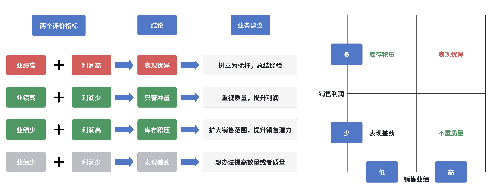{ width="1024" }
</figure>

矩阵分析法的最大优势在于其直观性和易理解性。矩阵可以帮助快速识别出关键问题，明确改进方向，极大减少“如何判断好坏”的困惑。

<figure markdown="span">
  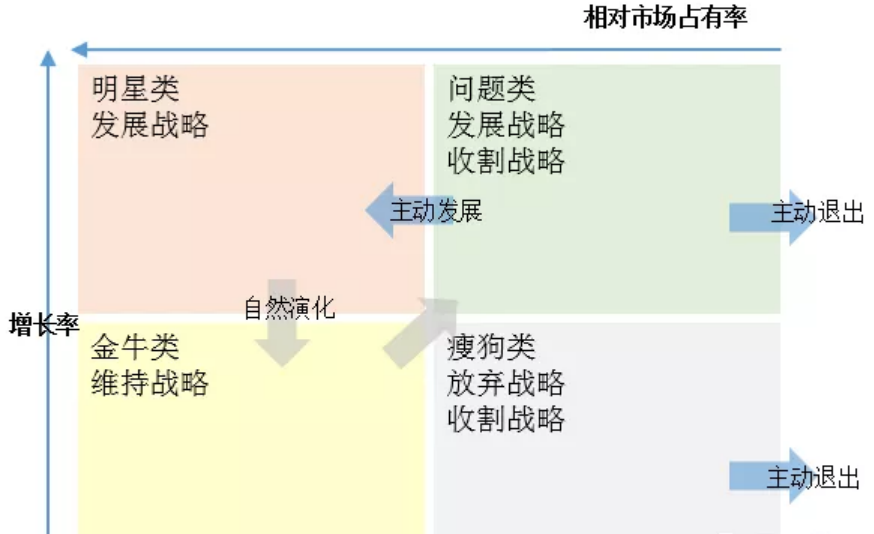{ width="800" }
</figure>

尽管矩阵分析法强大且直观，但在以下两种场景中不适用：

1. **存在极大/极小值时**：当数据中存在极大或极小值时，平均值会失去代表性。例如，假设一个团队中有3名销售人员的业绩占了57%，而其他17人的业绩很低，此时平均值无法反映实际情况。此类情况下，建议使用[分层分析法](#分层分析法)进行更精细的分析。
    <figure markdown="span">
      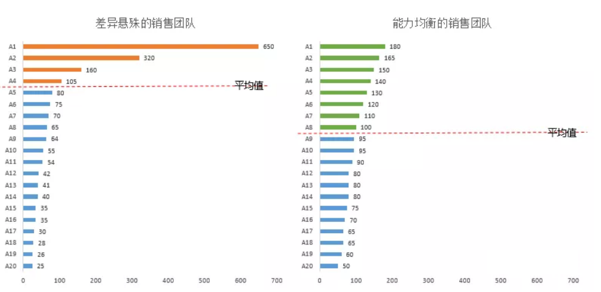{ width="800" }
    </figure>

2. **两个指标高度相关时**：当两个指标高度相关时（如消费金额和消费频次），矩阵分析会失效，数据点往往集中在一条线上，无法有效分散到4个象限中。此时矩阵分析法的业务解读能力接近0，因此不再适用了。
  
    <figure markdown="span">
      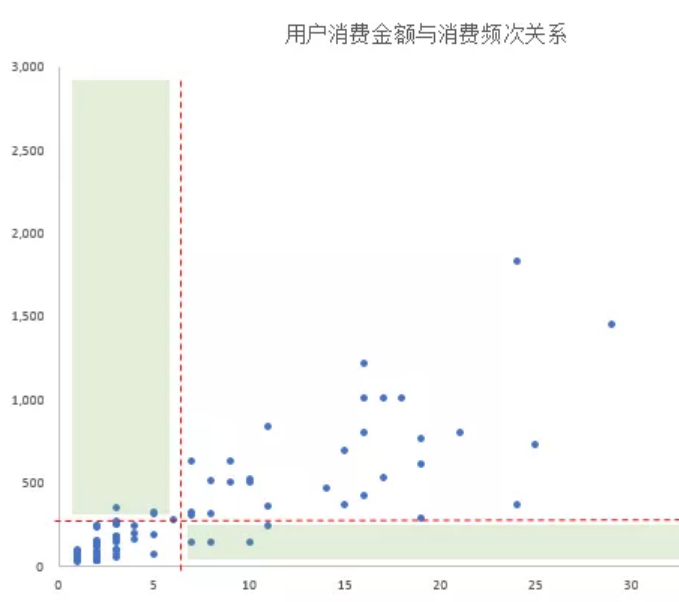{ width="450" }
    </figure>

## 指标拆解法

在业务分析中，指标之间的关系通常有两种：并列关系和串行关系。

1. **并列关系**：几个指标互不依赖，但都是上一级指标的组成部分。
    - 例如：业绩 = 客户数 × 消费率 × 客单价
        - 一级指标：业绩
        - 二级指标：客户数、消费率、客单价
    - 这些二级指标是并列的，它们相互独立，共同影响业绩。
2. **串行关系**：几个指标有前后顺序，互相影响。
    - 例如：新注册用户数 = 广告浏览人数 × 落地页转化率 × 注册页转化率
        - 一级指标：新注册用户数
        - 二级指标：广告浏览人数、落地页转化率、注册页转化率
    - 这些指标是串行的，用户必须依次经历广告、落地页和注册页。

<figure markdown="span">
  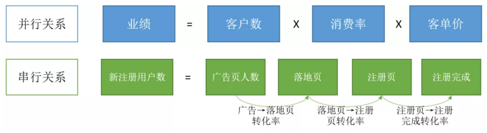{ width="800" }
</figure>

分析指标时，首先要弄清楚这些指标是并列关系还是串行关系。两种关系对应不同的分析方法：并列关系适合 **指标拆解法**，串行关系适合 **漏斗分析法**。这里我们首先介绍 **指标拆解法**。

**指标拆解** 的目的是深入了解问题，而不仅仅是发现问题。单看一个指标，只能看到结果，无法解释原因。通过拆解指标，可以从细节中发现问题，并获得新的思路。

举个例子：假设一个电商平台上月销售额为150万元，本月下降到120万元。如果只看销售额，除了少了30万元，我们无法知道更多信息。但通过拆解，我们可能会发现，本月注册用户增加了，但消费率大幅下降，导致销售额减少。这样我们就能进一步思考如何提高消费率。

<figure markdown="span">
  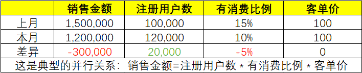{ width="600" }
</figure>

此外，不同的拆解方式可能揭示出不同的情况。比如，看似两个月都减少了30万元，但拆解后可能发现：

<figure markdown="span">
  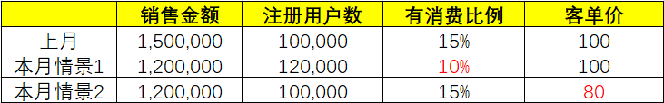{ width="600" }
</figure>

- 情景1：消费率下降较多。
- 情景2：客单价下降较多。

这两种情况对应不同的业务应对措施：提高消费率可能需要推出低价爆款吸引用户，而提升客单价则可以通过搭配销售或交叉销售来实现。因此，在制定营销策略前，先看拆解的结果是很有帮助的。

那么如何拆解指标呢？

1. **找到主指标**：
   拆解从一个重要的主指标开始，如利润、销售收入等。如果没有明确主指标，拆解只会让思路变得混乱。

2. **找到负责主指标的部门**： 
   不同的拆解方式适合不同的部门。找到合适的拆解方法后，相关部门可以根据结果进行改进。如果没有明确的责任部门，拆解就没有意义。 

3. **确认子指标有数据支撑**： 
   如果子指标的数据无法采集，拆解也无从谈起。需要确保数据采集的可行性。

4. **列出拆解公式，进行数据对比**： 
   这是最终的拆解结果，能够帮助我们清楚地看到问题所在。

<figure markdown="span">
  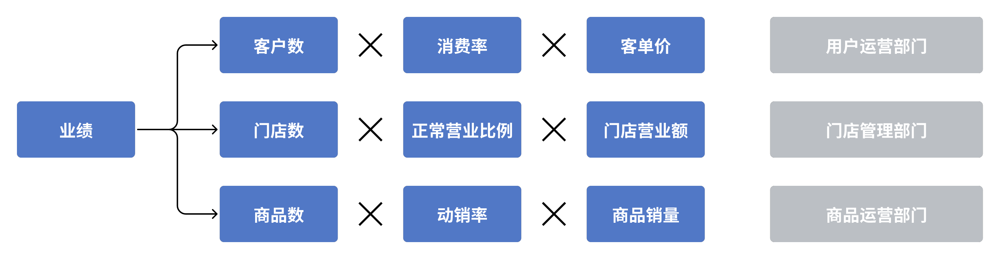{ width="800" }
</figure>

经过多年的实践，人们发现了一些经典的拆解方法，比如 **杜邦分析法**，它通过拆解利润为收入和成本两个部分，帮助企业清楚了解利润的来源和成本结构，从而优化运营。

<figure markdown="span">
  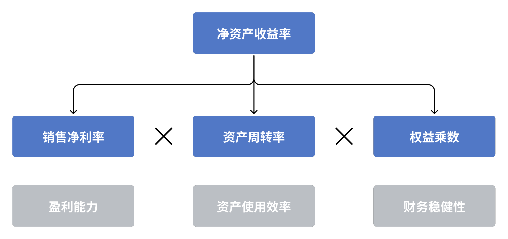{ width="500" }
</figure>

再比如零售业常用的 **“人货场”模型**，将销售收入按照用户（人）、商品（货）、渠道（场）进行拆解，帮助分析业绩表现。

<figure markdown="span">
  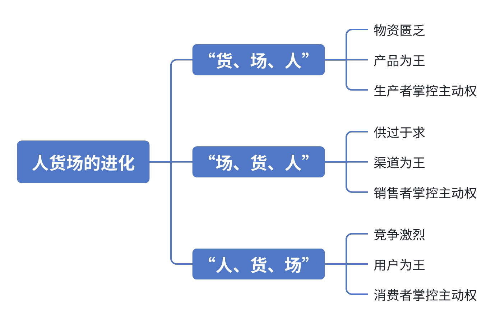{ width="500" }
</figure>

总之，**指标拆解法** 是一种常见且实用的分析工具，尤其在业务场景中能发挥巨大价值。

## 漏斗分析法

漏斗是形象地描述一个连续操作步骤的概念。以电商购物为例，用户在购物时至少要经历以下几个步骤：

1. 打开APP，进入首页。
2. 点击首页上的商品广告。
3. 进入商品详情页，查看商品。
4. 点击加入购物车，填写信息。
5. 进入支付页面，完成支付，商家发货。

整个过程包括：首页 → 广告页 → 详情页 → 购物车 → 支付，所有步骤环环相扣，前一步必须完成才能进入下一步。

然而，用户并不总是按照这条路径顺利完成每一步：

- 有些人看到广告后不感兴趣，直接离开。
- 有些人在详情页觉得商品不合适而放弃购买。
- 有些人在购物车页因为价格高而中途退出。

随着流程推进，参与人数逐步减少，用漏斗的形象描述可以很好地呈现这种情况。这就是漏斗分析法的直观表现。

<figure markdown="span">
  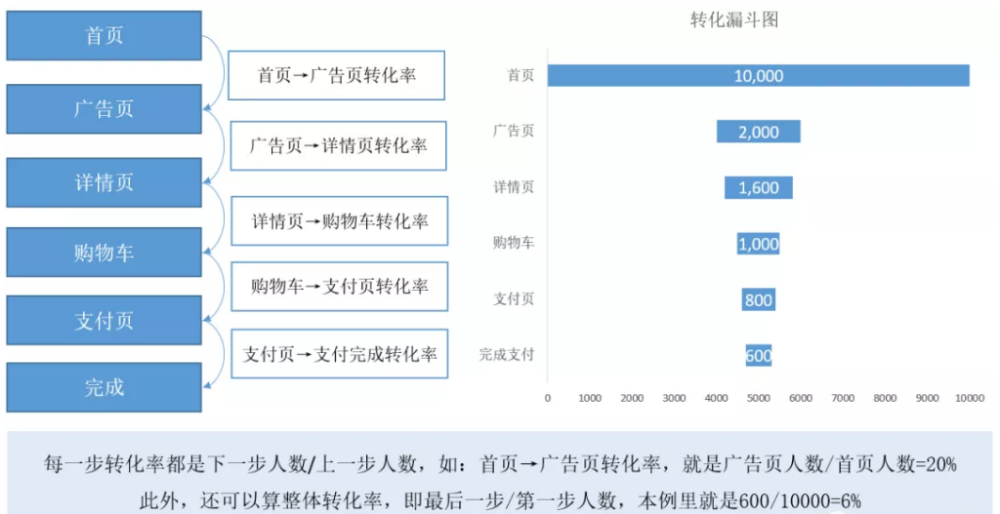{ width="800" }
</figure>

制作漏斗图需要满足以下三个基本条件：

1. **有前后关联的步骤**：  
   流程必须由一系列前后关联的步骤组成。例如，电商购物中的“首页→广告页→详情页→购物车→支付”就是一个典型的流程。在制作漏斗之前，要仔细梳理分析的流程，确保步骤明确。

2. **每个步骤都有数据记录**：  
   数据的完整性是漏斗分析的基础。如果每个步骤没有详细的记录，就无法进行有效的分析。虽然漏斗分析法广泛用于互联网行业，但它并非互联网专用。比如，传统门店的“进店→选货→试穿→成交”，如果能有效记录各个步骤的数据，也可以用漏斗分析法进行分析。

3. **从第一个环节开始统计**：  
   数据统计必须按照流程顺序来进行。例如，用户在电商APP中可能不会按照“首页→广告页→详情页→购物车→支付”的顺序完全执行，有时会跳出广告页再回来。所以在统计时，要严格按照设定的步骤来统计，确保每个步骤数据的连贯性。

<figure markdown="span">
  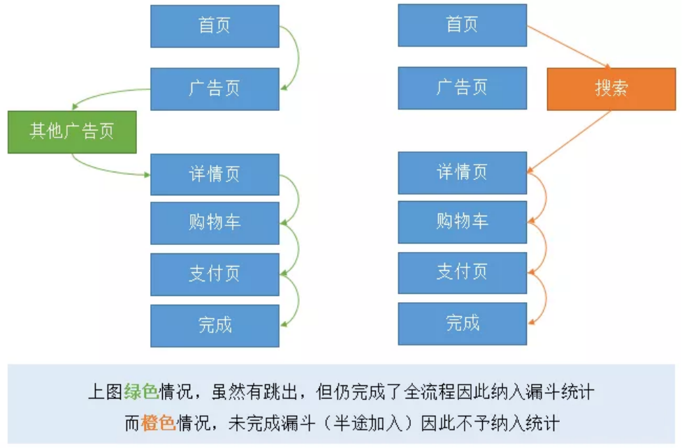{ width="600" }
</figure>

通过这些条件，我们就能正确地统计漏斗数据，包括每个环节的参与人数和转化率。

有了漏斗数据后，可以从不同角度分析问题，例如：

- **与相似的商品比较**：通过比较，找出转化率低的环节，从而发现改进的机会。

<figure markdown="span">
  { width="600" }
</figure>

- **与自身历史数据比较**：观察自己经营数据的变化趋势，评估哪一步骤的转化率有待提高。

<figure markdown="span">
  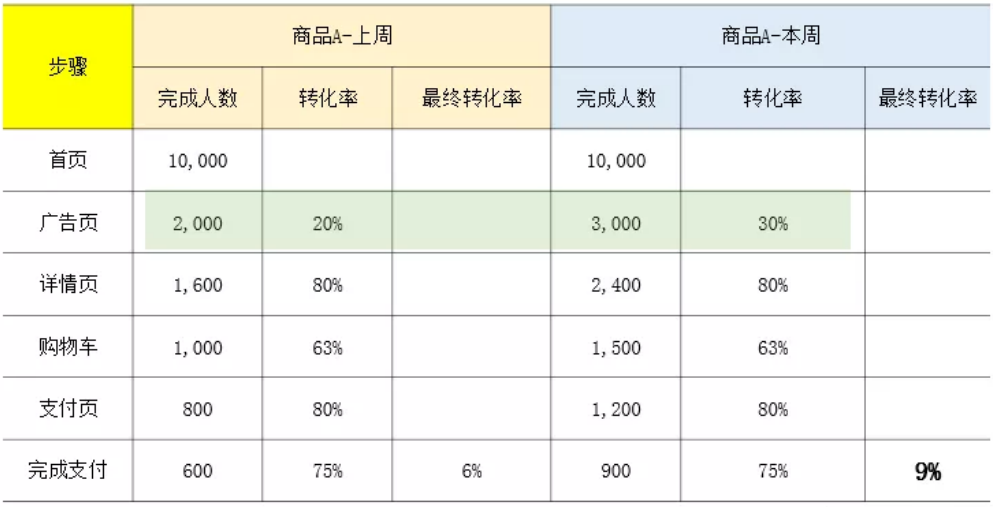{ width="600" }
</figure>

漏斗分析的最终目的是通过优化那些表现不佳的环节，提升整体转化率。

漏斗分析虽然能帮助找到问题所在，但它无法解释问题的根源。比如，看到广告转化率低，可能简单换个广告就能解决问题。但如果整个流程看起来都正常，用户还是不买单，原因可能非常复杂：用户可能在等促销，或在其他平台比价，或者不喜欢商品的某些细节。漏斗分析只告诉我们“发生了什么”，但不会告诉我们“为什么发生”。因此，它常常需要结合其他分析方法（如用户行为地图）来解决更复杂的问题。

每种分析方法都有局限性，漏斗分析也不例外，但它在连续步骤中的应用依然十分有效。

## 相关分析法

在日常工作中，我们经常会遇到类似的问题：

- 下雨和业绩下降有没有关系？
- 销售增长和新品上市有多大关系？
- 营销投入和业绩产出是否相关？

这些问题背后，都可以用一个基础的分析方法来解答——相关分析法。

简单来说，“相关”就是两个事件之间存在某种联系。比如：

- 广告投入和销售业绩
- 天气变化和门店人流
- 用户点击和消费行为

即使不做具体分析，我们凭直觉也能感觉到这些事件之间有联系，但没有数据支撑，很难明确这种关系到底是什么样的。相关分析的目的就是通过数据找到这些联系。

相关分析是指找到两个数据指标之间的相关性。比如：

- 用户在APP中频繁浏览一款商品，那么他会最终购买吗？

对于这个问题，不同的人会有不同的看法：

- 一部分人认为：看得多，说明感兴趣，所以会买。
- 另一部分人认为：看了很多次都没买，那大概率不会买了。
- 还有人认为：浏览次数和购买没有直接关系，可能要看有没有促销活动。

在这种情况下，只有通过数据分析，才能回答用户浏览行为和购买行为之间是否真的有关系。

有些指标之间的相关关系是显而易见的，我们称之为 **直接相关关系**。常见的例子包括：

1. **结构分析法**：整体指标和部分指标的关系。
2. **指标拆解法**：主指标和子指标的关系。
3. **漏斗分析法**：连续步骤之间的关系。

<figure markdown="span">
  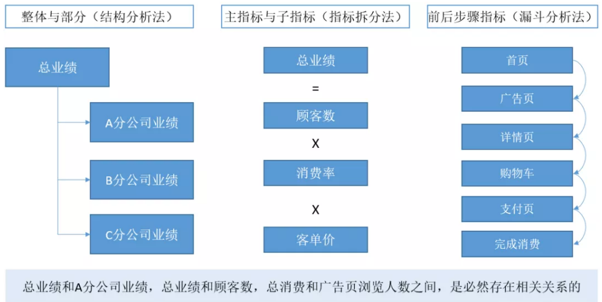{ width="800" }
</figure>

在直接相关的情况下，两个指标通常会同步变化（一起上涨或下跌）。例如：

- 公司整体业绩下降，A分公司的业绩也会下降（结构分析）。
- 客户数量减少，导致整体销售额下降（主指标与子指标）。
- 广告观看人数减少，最终的转化率也会降低（漏斗步骤）。

如果直接相关的指标没有同步变化，可能意味着有问题。比如，用户注册数大幅增加，但付费转化率持续下降，这可能意味着获客质量下降或获客渠道有问题，需要进一步分析原因。

<figure markdown="span">
  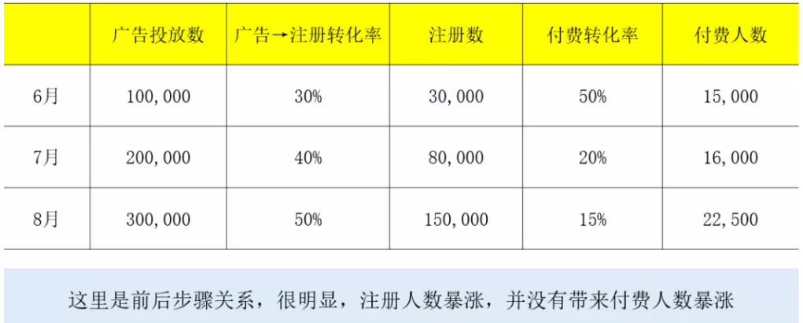{ width="600" }
</figure>

有些指标之间没有直接的因果关系，但理论上存在联系，我们称之为**间接相关关系**。例如，品牌广告和销售收入之间的关系：

- 广告增加，品牌知名度提高，理论上销售会增长。
- 但广告本身不带直接销售链接，无法精确地跟踪销售来源。

此时，可以使用 **散点图** 来分析间接相关关系。如果散点图中数据点呈现某种规律，就说明两者之间可能存在相关性。

<figure markdown="span">
  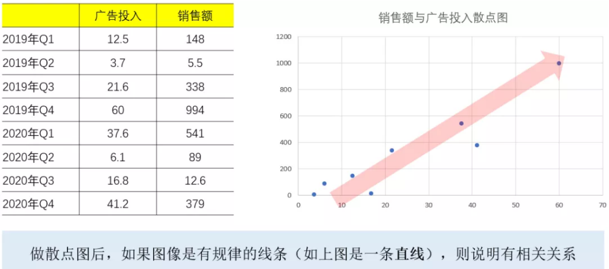{ width="600" }
</figure>

尽管相关分析是一个强大的工具，但它也有两个主要局限：

1. **相关不等于因果**：  
   两个指标有相关性并不意味着一个指标导致了另一个。相关分析只能表明两者的走势相似，但无法解释原因。比如，有一个经典的笑话：一棵树的高度与国家GDP高度相关，但这并不意味着树的成长推动了经济发展。

2. **无法处理非量化指标**：  
   相关分析依赖于定量数据。如果我们想分析一些无法量化的因素，比如旗舰店是否比社区店更有吸引力，这类问题就无法简单通过相关分析得出结论。旗舰店的吸引力可能与位置、装修等多重因素相关，无法仅通过几个数字来衡量。

## 标签分析法

很多情况下，我们想研究的影响因素很难直接用数据指标来表达。

比如：

- 社区店的生意是否比步行街店更好？
- 私域流量是否比公域流量的转化率更高？
- 刮风下雨的天气是否会比晴天带来更好的销售业绩？

像社区店、私域流量、刮风下雨这些因素，很难用单一的指标去衡量，但它们却确实会对业务表现产生影响。那么该如何分析这些因素呢？这时就需要用到**标签分析法**。

标签是对事物特征的简洁概括。比如在超市里，我们通过标签能快速识别商品的特性，例如“有机”、“无糖”或“儿童专用”等。这些标签帮助顾客快速了解商品，从而做出购买决策。

标签和数据指标之间是可以相互转换的。例如：

- “高收入”可以定义为年收入超过20万元。
- “畅销商品”可以定义为月销量超过500件。

因此，在使用标签时，一定要确保标准统一，并且所有人对标签的理解是一致的，避免出现误解。

标签分析是一种通过为难以量化的因素打上标签，并分析这些标签与其他指标之间关系的方法。例如，门店位置（市中心、郊区）和天气状况（晴天、雨天）等，都可以打上标签进行分析。

标签分析通常包含以下四个步骤：

1. 明确需要分析的影响因素。
2. 为影响因素打上标签。
3. 确定需要分析的指标。
4. 对比不同标签下的指标差异，得出分析结论。

比如，某南方省份的8月份经常下暴雨，大家普遍认为：下雨会影响门店的业绩。我们可以通过标签分析法来验证这个观点。

按照步骤：

1. 分析影响因素：天气状况。
2. 打上标签：晴天、小雨、暴雨等。
3. 确定分析指标：门店业绩。
4. 对比不同天气条件下的业绩差异。

    

    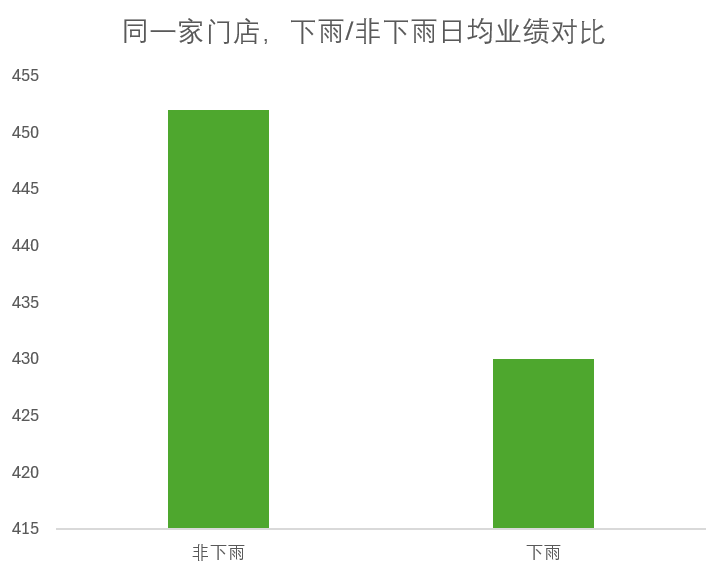{ align=left width=400 }

    !!! note ""

        - 明确要分析的影响因素：下雨
        - 把影响因素制作成标签：下雨/非下雨
        - 明确要分析的指标：8月门店日均业绩
        - 对比不同差异下，指标差异：下雨时，门店日均业绩下滑4.9%
        - 得出分析结论：下雨影响不大

    

通过初步分析可能发现：下雨天和晴天的客流量差异不大。这结果可能与人们的直观感受不一致，为什么大家觉得下雨天会影响业绩，而数据却没有明显变化？问题可能出在标签定义得不够细致。

进一步分析可以发现：

- 不仅雨天，炎热高温也可能会影响客流。
- 小雨和暴雨对客流量的影响显著不同。
- 暴雨严重时，公共交通受阻也会对客流产生影响。

<figure markdown="span">
  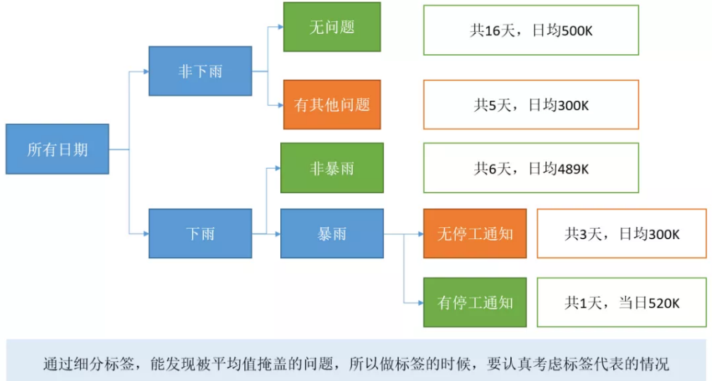{ width="600" }
</figure>

因此，我们需要细化标签，将天气状况划分得更详细。例如，区分出小雨、暴雨、高温等情况。更新后的分析结果可能会显示：

- 晴天和普通小雨对业绩影响不大。
- 高温和暴雨天气显著减少客流。
- 在极端天气下，特别是政府发布停工通知时，反而可能导致市民囤积物资，从而短期内增加门店销售额。

通过更加精准的标签划分，得出的结论更加符合实际，这样就能帮助门店管理者做出更好的决策。

标签分析的一大局限性在于，很多事情有多个标签，如果选择了不合适的标签，可能会得出错误的结论。

举个例子，我们对比某天社区店和CBD店的销售业绩，发现社区店的业绩低于CBD店。于是我们得出结论，社区店的销售表现更好。但如果那天是 **周末**，CBD区域的人流量本来就低，因为办公室关闭，导致CBD店业绩不佳。加入日期标签重新分析后，可能得出相反的结论——CBD店的潜力更大。

<figure markdown="span">
  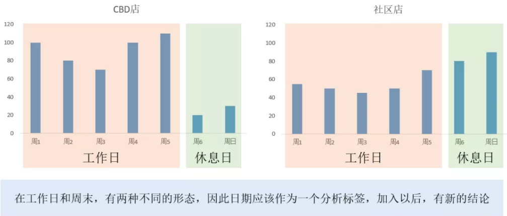{ width="600" }
</figure>

此外，还需要考虑其他因素：

- CBD店租金高，开店成本可能是社区店的两倍（开店成本）。
- CBD店的员工素质可能更高（人员素质）。
- CBD店面积大，商品种类更丰富（商品数量）。

当深入分析时，我们会发现，多个标签会叠加相互作用，因此不能仅仅依靠一两个标签进行简单的对比分析。这时候，就需要构建完整的分析逻辑，再通过标签进行深入分析。

## MECE 分析

MECE 是“Mutually Exclusive, Collectively Exhaustive”的缩写，意思是“相互独立，完全穷尽”的分类原则。通过 MECE 方法对问题进行分类，可以让分析更加清晰和全面，从而更容易找到答案。

很多人听到 MECE，可能会感到困惑，甚至觉得它非常难以掌握。常见的疑惑包括：

- 如何做到相互独立且完全穷尽？
- 是不是要了解所有可能性，才能穷尽问题？

其实，做到 MECE 并没有那么复杂。一个简单有效的方法就是**二分法**。

举个例子：某店长抱怨说，“遇到刮风、下雨、打雷，街上没人，生意就很差。”这个描述其实并不符合 MECE 原则，因为刮风、下雨和打雷之间既有联系，也有区别。它们并不是相互独立的。

<figure markdown="span">
  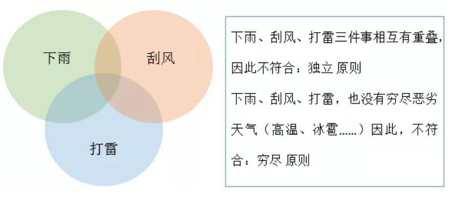{ width="600" }
</figure>

那么，如何才能做到 MECE 呢？

首先要明确分析目标：我们关心的并不是具体的天气现象，而是天气是否影响了人流。在分类时，应该先把影响最大的因素提取出来，再逐步分解其他次要因素。这个过程就像剥洋葱一样，从外层开始，逐层深入。

以天气为例，刮风、下雨和打雷三者中，下雨对人们出行的影响最大，因此应该首先把“下雨”作为主要因素划分出来。接着，可以用“是否下雨”这个二分法来进行初步分类。这样，我们就实现了相互独立和完全穷尽的分类。

尽管我们通过简单的“下雨/非下雨”分类做到了 MECE，但要进一步分析问题，还需要更精细的划分。例如，雨的强度也会影响人流——小雨可能不会影响，但暴雨则会显著影响人们的出行。这时，可以借助天气预报中的具体信息（如温度、降雨量）来进一步细分。

要更深入地进行分析，有两种方法：

1. **相关性分析**：收集降雨量等具体的气象数据，然后分析这些数据与客流量之间的关系。比如，收集10天的降雨天气数据与当天的客流量，绘制散点图，寻找两者之间的相关性。这种方法适用于没有经验数据积累的情况，灵活性较大，能够总结出新的规律。

2. **标签分析**：使用现成的标签，如气象局发布的暴雨警报（黄色、橙色、红色）等，直接观察不同标签下的客流变化。这种方法直观，适合已有标签系统的场景。

<figure markdown="span">
  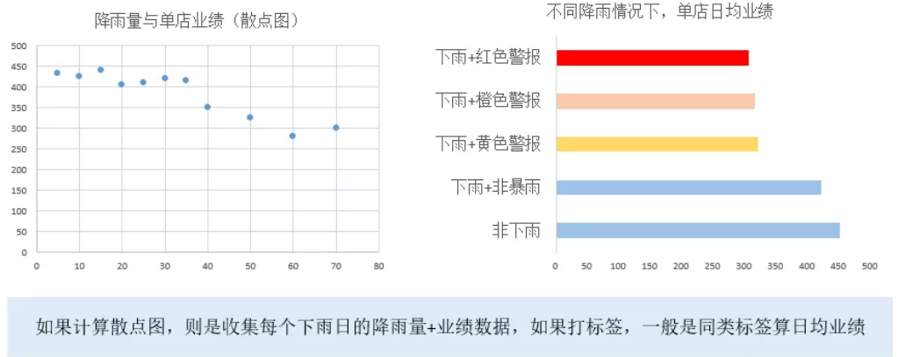{ width="800" }
</figure>

两种方法理论上都可行，选择哪一种主要取决于：

- 数据来源的便捷性和可靠性。
- 哪种方法能够提供更显著的区分效果。

<figure markdown="span">
  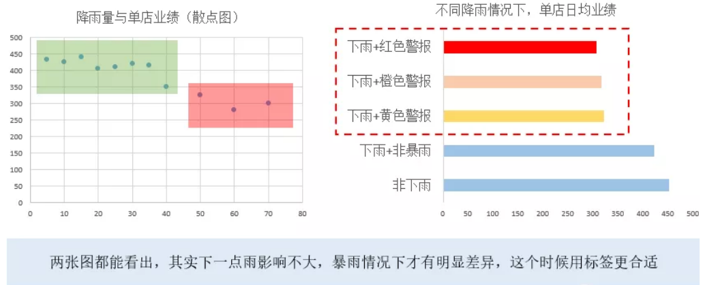{ width="800" }
</figure>

通过这一步的细分，还可以进行进一步的分类，比如根据不同的降雨量、时间段或其他相关因素来继续细化分析。

<figure markdown="span">
  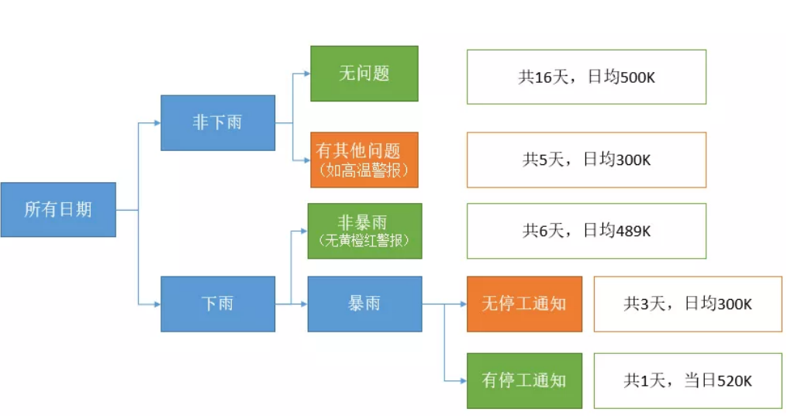{ width="800" }
</figure>

上面是一个简单的例子。实际上，MECE 作为分析问题的基本方法，在解决复杂问题时非常有用。很多问题都有多个交织的因素，因此需要用 MECE 原则将这些因素一一列出，并逐步确认每个因素的影响。

以影响门店业绩为例，除了天气，可能还包括：

- 门店的位置
- 开业时间
- 货物供应是否充足
- 促销活动是否到位

这些因素相互叠加，因此在分析时，需要通过 MECE 法，逐步选出最重要的影响因素，像剥洋葱一样找到问题的核心。

尽管 MECE 法非常有效，但它也有一个显著的局限性：并非所有的影响因素都能通过数据直接观察到。

举个简单的例子：为什么用户会流失？通常我们会在用户3个月或6个月没有互动时标记为流失，但实际上，用户可能在流失之前已经有两个月没有登录过，而我们却没有数据记录这些行为。

用户流失的原因可能包括：

- 产品体验不佳？
- 缺乏促销活动？
- 服务不到位？
- 用户根本不再有需求？

这些复杂因素由于数据缺失，变得难以分析。即使用 MECE 方法进行了详尽的分类，也可能没有足够的数据支持这些结论。

类似的情况还有很多，比如新用户获取或新产品上线。这些场景下，往往缺乏历史数据积累。在这种情况下，我们需要采用其他思路来解决问题，比如通过设计实验测试真实的影响因素、修改业务流程提高数据质量、或进行问卷调查等方式。这些方法可以帮助我们补充缺失数据，找到问题的真正原因。
