数据报表和数据看板通常包含大量指标，指望一次性看清所有问题并不现实。因此，建议按照以下步骤逐步进行分析：

<figure markdown="span">
  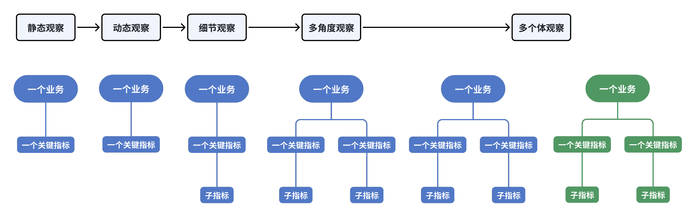{ width="1024" }
</figure>

1. **静态观察一个业务的关键指标**：首先，关注业务中的一个核心指标，建立对业务的初步认识。例如，本月的整体销售收入是多少？这有助于形成对当前业务状况的基本理解。

2. **动态观察该关键指标的变化趋势**：接下来，分析该指标在一段时间内的动态变化。例如，查看今年1月到现在每个月的销售收入，并与去年同期进行对比。通过趋势分析，掌握指标的规律性变化。

3. **细化观察关键指标的子指标**：深入分析指标构成，了解其细节。例如，整体销售收入是由哪些门店贡献的？各门店的比例如何？这些比例是否发生了变化？进一步探讨有哪些店铺业绩下滑（问题点），哪些店铺表现突出（机会点）。这一步帮助你深入理解指标背后的业务动态。

4. **关联分析另一个关键指标**：在掌握了一个核心指标的基础上，再引入另一个关键指标进行对比。例如，结合整体销售收入与成本，分析成本与收入的关系，了解业务的盈利情况。

5. **跨业务对比分析**：最后，将两个业务的关键指标进行对比，找出各自的特点与差异。通过对比，不同业务的优劣势就能更清晰地展现出来。

按此顺序，从简单到复杂、由浅入深，逐步展开分析。每一步都能得出明确的结论，避免因数据复杂性而陷入分析困境。

## 时间分析法

通过分析一段时间内指标的连续变化趋势，来描述业务发展的状况，并总结出发展规律的方式，称为时间分析法。在分析连续数据时，不能孤立地看待单个时间点的数据，而是要将其作为整体趋势的一部分进行观察。通过这种整体视角，可以建立评判标准，判断指标的波动是否属于正常现象。如果出现异常波动，还需要结合指标的具体含义，分析这种波动对业务是有利还是不利。

时间分析法可以细分为以下四种具体方法：

### 趋势分析法

趋势分析法是指通过分析某个指标在连续时间内的变化趋势，来判断业务走向的分析方法。以“月总销售收入”为例，按月统计时，商业机构的收入通常呈现三种基本形态：

<figure markdown="span">
  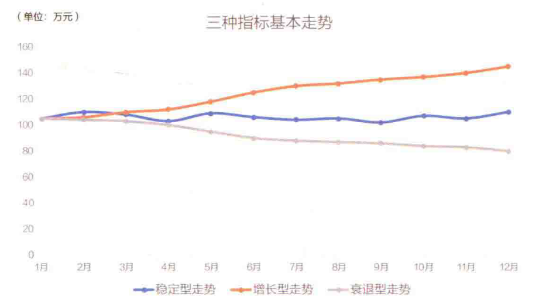{ width="800" }
</figure>

- 稳定型走势：每个月的收入固定。
- 增长型走势：每个月的收入都比前一个月高。
- 衰退型走势：每个月的收入都比前一个月低。

这三种走势中，判断好坏的标准通常很直观：

- 增长型 ≥ 稳定型。
- 稳定型 ≥ 衰退型。

为了量化这种波动，人们引入了 **环比** 的概念，用来衡量某一期数据相较于上一期的变化幅度。环比的计算公式为：`环比=当期数据÷上一期数据-1`。

当然，增长趋势并非总是线性的，即使整体趋势是增长，也可能偶尔出现数据下跌。因此，通常以月度、季度或半年为周期来审视增长趋势。一般来说，只要连续3期环比增长，就可以认为“呈现上涨走势”。走势结束要么以观察期结束为准，要么以连续出现3次增长停滞（不变或下跌）而宣告结束。如图所示，虽然一年内有3个月是环比下跌的，但其他月份都在上涨，因此还是会说年度呈现增长态势。

<figure markdown="span">
  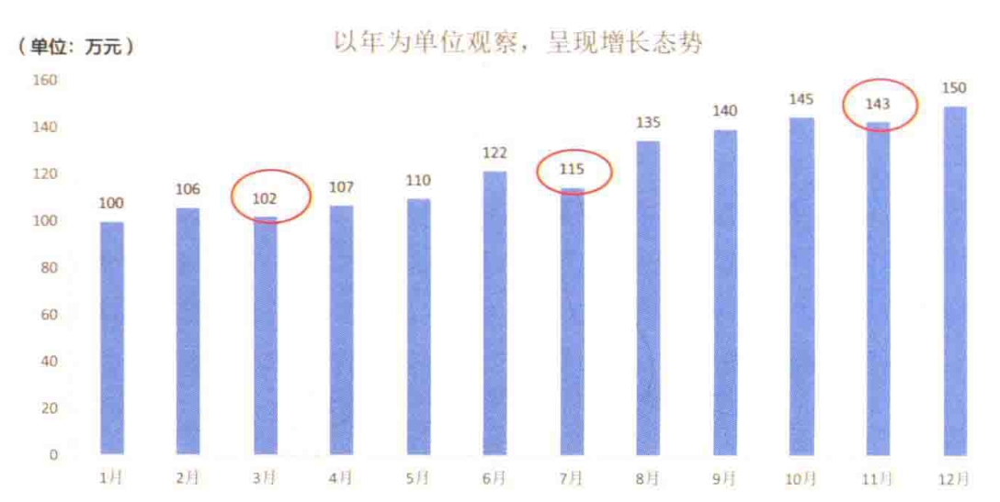{ width="800" }
</figure>

当连续3期环比下跌时，则称为“下跌走势”。走势的终止可以以观察期结束为准，也可以通过连续3期不再下跌（出现上涨或平稳）来判定走势结束。

在商业运营中，很多行业会受到经济周期或政策环境的影响，出现显著的长期波动。因此，通过趋势分析可以有效判断以下情况：

- 当前是否进入上升或下跌周期。
- 如果已进入某一周期，预估其可能的利好或利空影响。
- 在最优或最差的情况下，当月可能剩余多少资金。

这种分析可以帮助企业提前预判，并做好相应的资源准备。

虽然在视觉上，人们更容易接受上升的趋势，期待收入越涨越高，看到下跌则容易引发担忧。然而，对于“产出”类的结果性指标，不应简单地认为“越高越好，越低越差”。实际业务中，还可能出现以下几种情况：

- 波动属于自然变化，例如淡旺季交替或大小年轮替。
- 波动源于产品或业务生命周期的自然结束。
- 波动是企业内部有计划的行动，带来的预期结果。

因此，不能仅凭直觉判断波动的好坏。除了识别大环境带来的增长或下跌趋势外，还需要结合自然周期、产品生命周期和内部主动行为等因素，才能做出更为准确的判断。

### 自然周期分析法

许多商业模式会随着季节或时间的变化而产生自然波动。例如，在B2C零售、服务、餐饮娱乐等行业，通常周末或节假日的生意会比工作日更好。这种趋势在销售收入上表现为：工作日收入较低，而周末收入较高。

然而，对于B2B或B2B2C类企业，情况则有所不同。像批发、商贸、对公服务等行业，工作日才是商讨、谈判、签约、施工、验收、付款的高峰期，而周末通常是休息日。相应地，收入表现为：工作日较高，周末较低。

<figure markdown="span">
  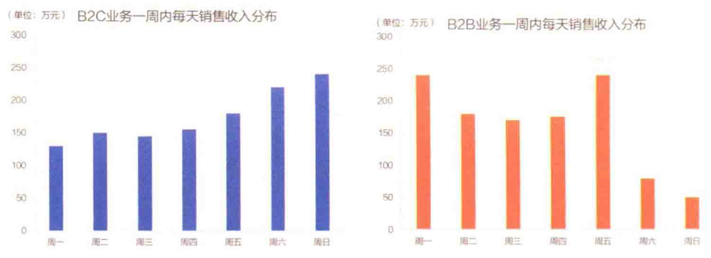{ width="800" }
</figure>

掌握了这些基本的规律后，在观察数据走势时就能避免不必要的担忧。比如，在下图左侧的例子中，虽然第二周的周一到周三销售收入似乎出现了显著下滑，但由于工作日本来就是淡季，而到了周五销售迅速回升，说明这种波动是正常的，可能只是偶然波动。而在下图右侧的例子中，尽管是周五，但销售收入并未如预期反弹，且周末的收入也低于前一周，这就表明有潜在问题，需要进一步调查。

<figure markdown="span">
  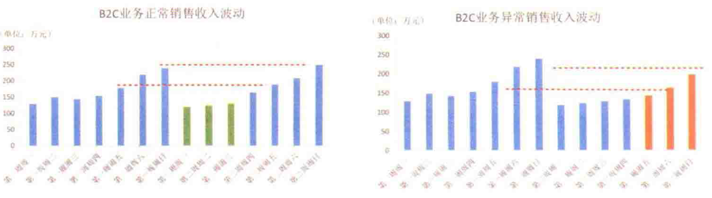{ width="800" }
</figure>

按月度观察，也会发现类似规律。例如：

- 公历2月常遇到春节，很多公司到农历正月十五后才恢复正常运营。
- 公历4月和5月有清明节和劳动节，农历八月（公历9月左右）有中秋节，公历10月有国庆节。
- 公历12月临近元旦，一些外企会在圣诞节期间放假。

这些节假日会引发收入数据的自然波动：

- 普通消费者的消费行为在节假日得到释放。
- B2B企业则需要在假日前完成验收、付款和签约。

还有一些自然波动是季节性的，因为许多业务受季节需求影响，例如：

- 冬季：保暖服饰、白酒、暖手宝、电热毯、厚被子销量上升。
- 夏季：饮料、啤酒、冰箱、电风扇成为热销产品。
- 春秋季：旅游、户外运动等活动更加频繁。

季节与天气往往相互作用，形成区域性的特色需求。例如，华中地区冬季没有集中供暖，因此保温产品的销量比北方更高。而商家通常会提前数月备货，导致收入数据提前反映季节性需求变化。特殊的天气条件，例如过冷或过热的年份，也会影响销售趋势，造成月度波动差异。以口罩为例，疫情前的口罩销售高峰通常在冬季和春季，因为这些季节呼吸系统疾病高发，销售曲线可能如图所示。

<figure markdown="span">
  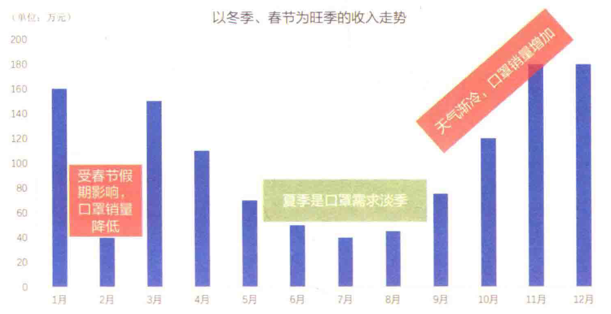{ width="800" }
</figure>

在观察销售数据指标时，结合时间维度与商业模式，分析每周（区分工作日/周末）、每月（节假日/非节假日）、一年四季等的波动，可以发现自然周期规律。当指标的波动符合这种规律时，一般不必过于担心，首先观察它是否在过去的波动范围内。如果在范围内，说明一切正常；如果超出或逆周期波动，则说明可能出现问题，需要特别关注。

当然，并非所有波动都归因于自然周期，有些属于业务自身的“生命周期规律”，这也是需要注意的部分。

### 生命周期分析法

很少有商业模式能够保证企业始终处于持续增长状态。用户需求会变化，技术会革新，市场竞争也会加剧，因此每种商业模式都有其增长极限，之后往往会进入衰退期。这种变化趋势被称为“生命周期走势”。需要注意的是，生命周期的计算并不是按照自然时间来统计的，而是从产品或业务上线的时间点开始，按月计算。

典型的生命周期走势在科技类产品中尤为明显，例如手机、电脑、平板等。即使这些产品在发布时设计前卫、功能强大，但随着竞争对手快速推出类似产品和新技术的出现，用户很快会转向更新的产品，导致生命周期的表现特别显著。类似的还有女性服装，由于季节性和潮流的变化，生命周期更短，通常一款新品的热销期只有6到8周。

<figure markdown="span">
  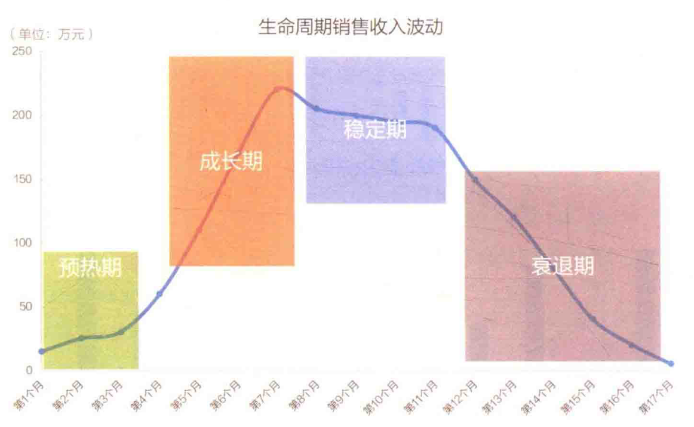{ width="800" }
</figure>

生命周期通常分为以下四个阶段：

- **预热期**：新品刚推出时，市场接受度较低，处于宣传期，销量不高。
- **成长期**：市场逐渐接受，销售量开始大幅增长，产品铺货加速。
- **稳定期**：销售量达到顶峰，随后进入小幅回落阶段。
- **衰退期**：销量显著下滑，企业开始筹备新产品的推出。

在不同阶段，可以分别统计每个阶段的收入，也可以统计从产品上市到退市整个生命周期的收入（即LTV，Life Time Value，生命周期价值）。对生命周期曲线的分析具有重要意义：

<figure markdown="span">
  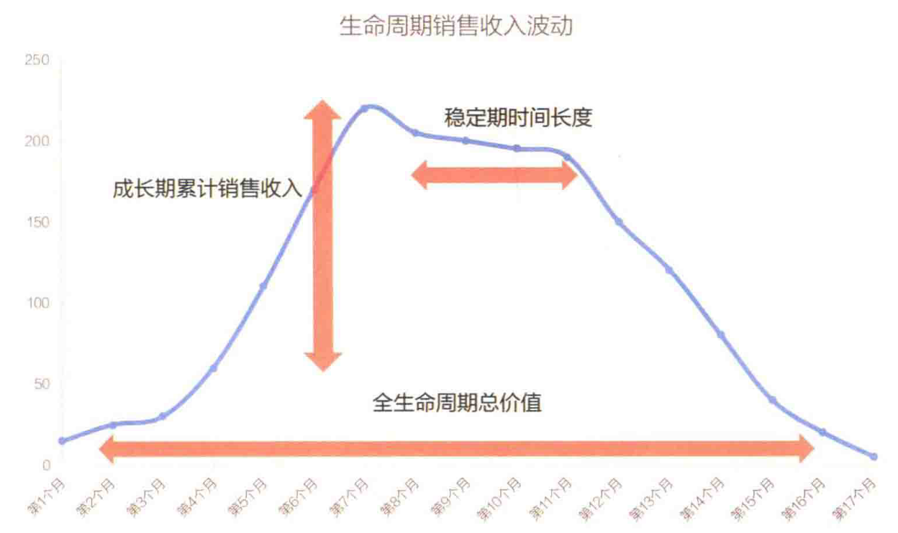{ width="800" }
</figure>

1. **识别波动性质**：有助于区分规律性波动和非规律性波动。
2. **业务状态判断**：可以帮助判断当前业务处于哪个发展阶段，从而制定相应策略。
3. **新业务决策参考**：为未来业务选择提供参考，预估新业务的生命周期价值。

在以生命周期曲线作为判断依据时，可以采用以下三种方法：

1. **单业务评价**：成长期冲得越高、稳定期越长、LTV越大越好。针对具体业务时，这是一种简单的衡量标准。
2. **标杆对比**：当有标杆产品作为参考时，新的业务发展趋势越接近标杆，说明新品表现越好，偏离标杆则表明可能存在问题。
3. **收入预警**：当产品收入走势出现变化时，及时发出预警。例如，通过对比标杆产品的走势，当现有产品收入连续下降时，可以根据其生命周期的阶段判断是否进入衰退期或是否只是稳定期的短期波动，从而采取相应措施。

参考的预警标准如下：

- **拐点1**：销售收入环比大幅增长（10%以上），且连续两次以上。预警：可能进入成长期。
- **拐点2**：销售收入环比增速放缓（5%以内），并出现环比负增长。预警：可能进入稳定期。
- **拐点3**：销售收入环比连续两次以上负增长。预警：可能进入衰退期。

当出现这些预警时，可以进一步监测趋势或使用更多分析手段确认问题，以便及时调整策略。生命周期分析法虽然不是唯一的判断标准，但它是一个非常敏感且有效的监测工具。

<figure markdown="span">
  { width="800" }
</figure>

需要注意的是，除了生命周期，主动行为也会影响收入表现。某些主动行为甚至可能改变生命周期或自然周期的形态，因此在分析时也需要关注这些因素的影响。

### 主动行为分析法

企业主动开展的商业行为会改变收入指标的形态。典型的如“双11”，在2009年以前，11月11日只是一个普通的日子。自从大型电商平台开始集中在11月11日进行大促销以后，“双11”作为购物节的观念便深入人心。很多公司的收入曲线，会在11月有明显暴涨，同样还有“双12”“6.18”等“人造节日”。某公司11月的销售收入走势，如图所示。

<figure markdown="span">
  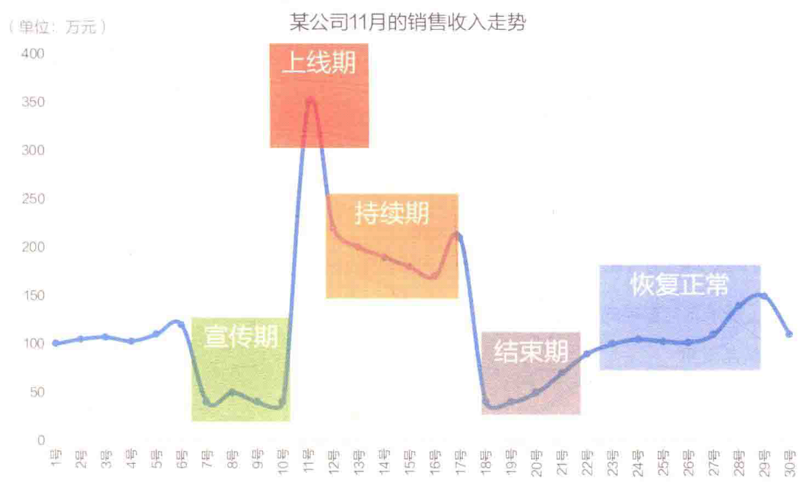{ width="800" }
</figure>

以促销活动为例，促销活动前后，经常有这5个阶段。

- 宣传期：活动宣传开始，投机的用户开始停止消费，等待活动，总销售收入下降。
- 上线期：活动刚上线，参与的人数最多，销售收入冲得最高。
- 持续期：活动持续，陆续有人参与，销售收入低于巅峰，但仍高于平均水平。
- 结束期：活动结束后，大量用户提前透支了消费，导致销售收入短暂下跌。
- 恢复正常：活动影响已消失，用户按正常水平购买。

通过记录业务方的行为，可以配合销售收入曲线，识别出这些动作的影响点与影响力度。从而辨识重大活动的效果。并且，不同力度的活动，销售收入曲线形态也会有差异，单纯地通过销售收入曲线变化，也能识别出哪些活动效果明显，哪些活动不温不火。

<figure markdown="span">
  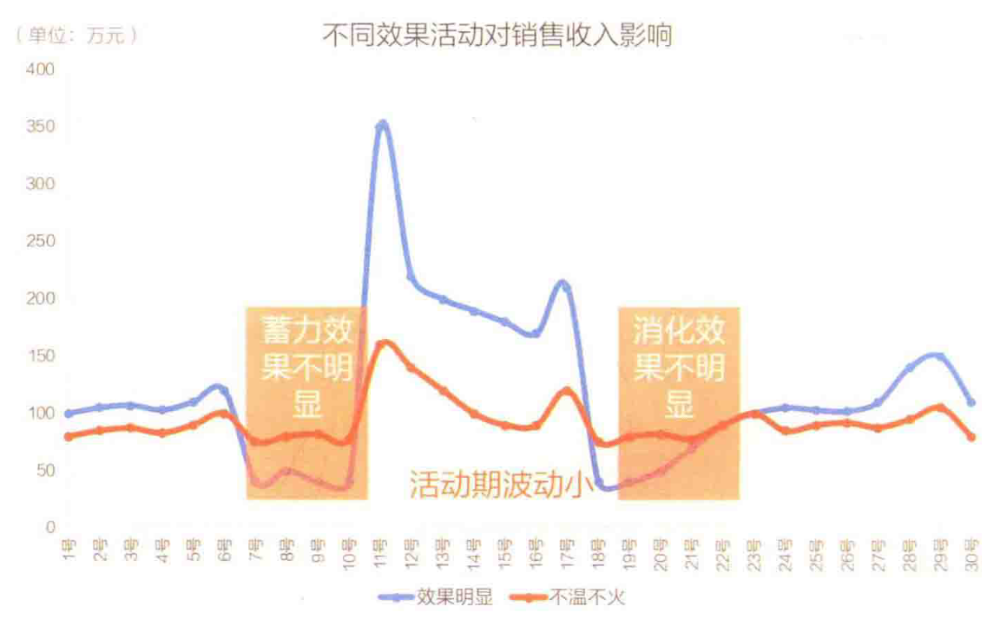{ width="800" }
</figure>

企业的主动行为可能对企业的销售有正向和负向两种影响。

- 带来正向影响的行为
    - 新品上市
    - 新店开业
    - 促销、优惠活动
    - 主动拓展用户
    - 主动清仓
  
这些都会给收入曲线带来额外的增长动力，带来收入曲线的正波动。

- 带来负向影响的行为
    - 系统出现BUG
    - 产品质量问题
    - 关店、裁员

这些都会给收入曲线带来额外的负面影响，导致收入曲线的负波动。

还有一些，效果是不确定的，典型的如产品更新。

- 有可能新品的体验更好，更受用户青睐。
- 有可能新品不受用户欢迎，反而使用更少。

总之，在产品正式上线前，一切皆有可能。虽然上线前可以做一些测试，验证想法，但实验室的情况与真实的商业场景还是有差距的，因此需谨慎对待。

还有一些行为效果难以直接衡量，比如品牌广告。品牌广告主要是提升品牌形象，告诉消费者“我们的品牌高端大气上档次”，但不会附带直接的购买链接或促销优惠，因此其效果难以像促销广告那样精确评估。无法明确指出用户看了广告后立即下单，更多的是一种长期影响。

为更好地追踪这些行为对收入的影响，建议建立 **行为日志**，将每次活动和决策详细记录下来，并在收入曲线上标注。这样能直观地看到哪些行为导致了收入的重大波动。

但是，这样只能粗略地识别产生重大影响的行为，当多个行为叠加或其他因素影响时，识别难度增加。尤其在以下几种情况下：

- 企业的重大行动和自然周期经常是重叠的。比如，年底开展大促销、周末搞活动。
- 企业的重大行动和生命周期经常是重叠的。比如，新品上市发布、旧货退市的清仓促销。
- 企业的重大行为和外部因素经常是重叠的。比如，政策发生了变化，对应调整经营方法。

<figure markdown="span">
  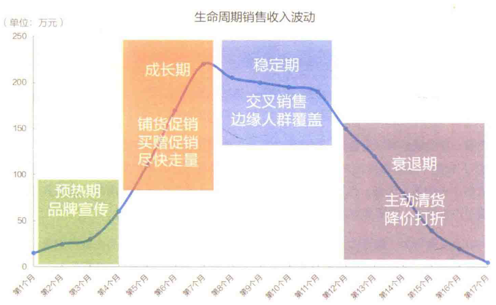{ width="800" }
</figure>

这种多因素重叠会导致识别问题变得异常复杂，需要结合多因素分析。但在此之前，需要提前对每个行为进行详细的记录，对重大行为结果有所了解，这样才能为多因素分析打好基础。

## 结构分析法

结构分析法是一种通过拆解整体指标，深入分析其子指标组成，从中发现问题的分析方法。要使用结构分析法，首先需要了解整体的构成，能够明确其内部结构。举个例子，某企业的销售部门架构如图所示。

<figure markdown="span">
  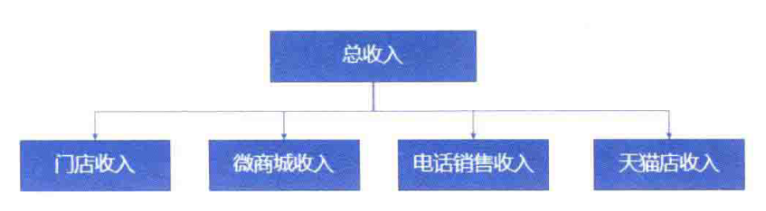{ width="800" }
</figure>

在看数据时，可以观察其整体收入的构成。看起来，整体收入在缓缓持续上涨，再看其细分结构。

<figure markdown="span">
  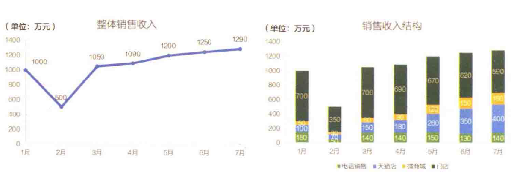{ width="800" }
</figure>

- 实体门店的收入已经连续5个月在下降。
- 天猫店、微商城渠道在持续增长。
- 电话销售的收入保持稳定。

内部结构已经发生了重大变化，且变化趋势没有减缓。此时就会引发更多的思考：是要继续延续这种趋势，还是做出调整呢？

!!! Info

    需要注意，结构分析法本身并不能直接给出决策依据。结构性变化本身没有绝对的好坏之分，即便某些变化看起来符合预期。例如，电商渠道和微商城的增长似乎与数字化转型的方向一致，但不能仅靠这个指标下结论。还可以继续考虑以下因素：

    - 整体的成本/收入变化趋势。
    - 电商和微商城渠道的成本消耗及其与收入的比率变化。
    - 门店的细分结构，收入下滑的门店是否本身就运营不佳。
    
    综合这些因素后，才能对结构性变化做出更全面的评价。结构分析法的长处在于发现问题，但并不擅长解释问题。

如果企业对结构有明确的目标，例如年度必须实现数字化转型，线上渠道（天猫店和微商城）的销售收入占比要达到50%以上。那么，可以通过结构分析来进行目标追踪，按比例分析各渠道的收入占比。例如，当前线上渠道占比为43%，未达到目标。企业可以进一步加大线上投入，同时对线下门店进行结构分析，识别亏损门店，通过关闭表现不佳的门店，将资源集中投入线上渠道，以加快数字化转型的进程。

<figure markdown="span">
  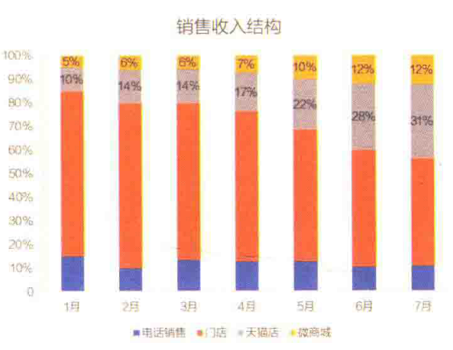{ width="400" }
</figure>

通过结构分析法，我们能快速定位问题的发生点，从而激发后续的解决问题思路。

结构分析法的应用可以分为以下四个步骤：

1. **确定要分析的关键指标**：首先，明确需要关注和分析的核心指标，通常是企业的收入、成本、用户增长等。
2. **了解关键指标的构成方式**：接着，分析这些关键指标是由哪些部分构成的，比如按渠道、地区、产品类别等进行细分。
3. **跟踪关键指标的走势**：持续关注指标的变化趋势，了解其内部构成是否发生了明显变化。
4. **分析结构变化**：当关键指标出现显著的上升或下降时，找出其中变化最大的部分，并深入分析，发现可能的问题。

有时，若各部分比例未发生明显变化，说明现有的结构分类并非问题的核心。这时，可以尝试从不同维度（如地区、渠道、用户类型、商品类别等）重新分类，再次进行观察。

<figure markdown="span">
  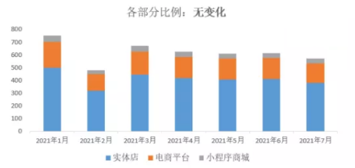{ width="400" }
</figure>

结构分析法是一种在用户、产品、活动等多种场景中广泛使用的发现问题的工具。从本质上看，它通过不同的分类维度将一个整体指标拆解开来，并进行分类对比，帮助企业从细节中找到业务改进的突破口。

## 分层分析法

分层分析法用于将数据按一定顺序划分为不同层次。例如，按销售收入对店铺进行分层，可以分出高收入、中收入、低收入的店铺；按用户价值分层，则可以识别高价值、中价值、低价值的用户。由于收入是一个连续变量，每个店铺或用户贡献的销售收入都是具体数值，因此，如何定义“高、中、低”层次的划分标准至关重要。

分层分析法的主要作用是应对 **平均值失效** 的情况。使用平均值容易掩盖个体差异，因为极端样本会影响整体的平均值，从而导致误导性的判断。例如，假设两个门店的平均日收入为2万元。这个数字看似合理，但实际情况可能是一个门店当天的收入为4万元，另一个门店则处于歇业状态。这种情况说明，单纯依赖平均值无法反映真实的差异，而分层分析可以帮助揭示这些隐藏的问题。 

分层分析法的应用可以分为以下三个步骤：

1. **明确分层对象和分层指标**。例如：
    - 想区分用户消费力，分层对象就是：用户，分层指标就是：消费金额
    - 想区分商品销售额，分层对象就是：商品，分层指标就是：销售金额
    - 想区分门店营业额，分层对象就是：门店，分层指标就是：营业收入
2. **查看数据，确认是否需要分层** 分层分析适用于应对极值影响较大的情况。如果数据中的个体差异较小，分层分析可能不必要。
    <figure markdown="span">
        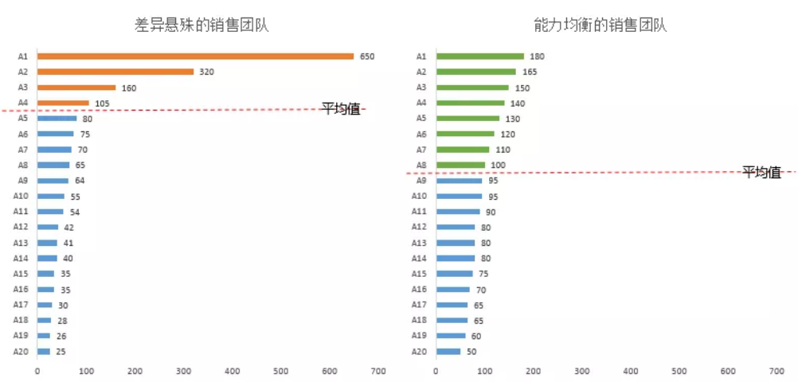{ width="800" }
    </figure>
3. **设定分层的层级** 这通常是最具挑战性的部分，因为如何定义“高”与“低”常常引发争议。
   
这里介绍一些常见的分层方式：

### 二八分层法

应用经典的“二八法则”（即帕累托原则），将所有个体按指标从高到低排序，前80%的累积值划为第一层，其余归为第二层。

<figure markdown="span">
  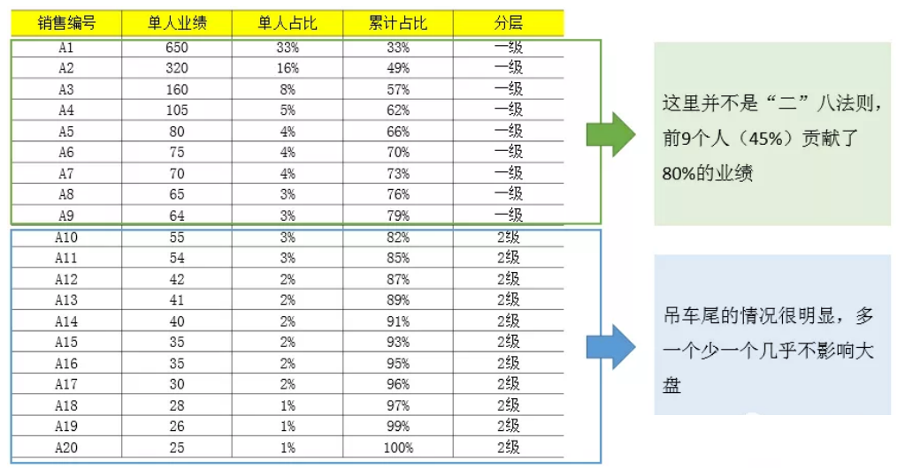{ width="800" }
</figure>

### 二四六八十分层法

还可以用“二四六八十”法则，即计算个体与平均值的差异，然后：

- 比平均值高的，根据平均值的2倍、4倍、6倍、8倍、10倍，分层
- 比平均值低的，根据平均值的1/2、1/4分层

这种方法有助于区分远高于或低于平均水平的个体。

<figure markdown="span">
  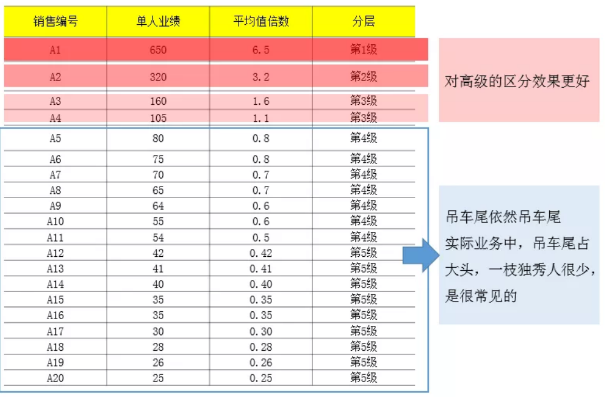{ width="800" }
</figure>

### 十分位分层法

- 将所有个体按指标从高到低排序。
- 按前10%、11%~20%等，划分为10个组。
- 计算每个组的平均值，形成分层结果。

<figure markdown="span">
  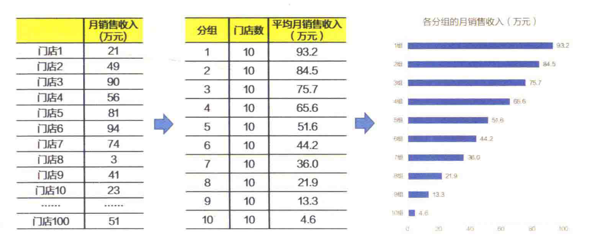{ width="800" }
</figure>

此时可以根据需要，划分为两类（高/低人三类（高/中/低）或五类（高/较高/中/低/较低）等。

<figure markdown="span">
  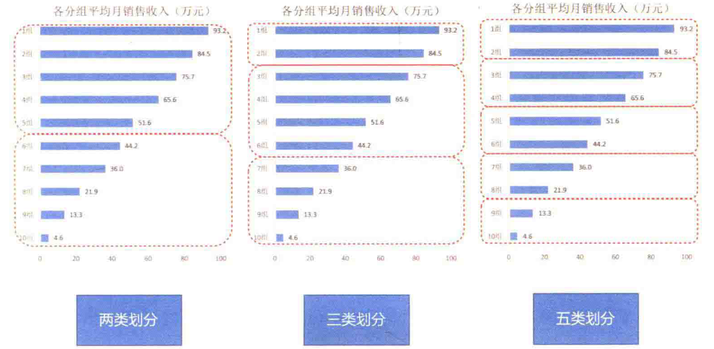{ width="800" }
</figure>

分层分析的最大作用是帮助我们明确谁是业务的主力，谁表现落后，从而推动决策从“人海战术”转向“精兵简政”。以销售团队为例，假如发现A1号销售员表现优异，我们不再简单地认为：“人均业绩是100万，那要达成1000万业绩，就得增加10个人”，而是会思考：“如何找到另一个像A1这样的顶尖销售员？”

在这个过程中，通常会有几个常见的思考方向：

- **人员画像**：A1的学历、年龄、从业经验如何？通过分析这些特征，可以尝试招募与A1画像相似的人，期望他们能取得类似的成绩。
- **人员行为**：A1具体做了哪些事情获得如此高的业绩？对应的做法是，识别出A1的关键行为，并让团队其他成员效仿，从而提升整体表现。
- **目标客户**：A1的客户是否更容易成单？如果是，策略应当是让其他销售员多开发这些“容易”客户，同时再招新人负责那些更具挑战的客户群。
- **成长经历**：A1是如何从普通销售员中脱颖而出的？稳定性如何？如果A1是通过持续努力成长起来的，那我们可以尝试复制这种培养路径。如果A1成功更多依赖运气，那或许应该采取“多招新人，大浪淘沙”的策略，期待再挖掘出一个像A1这样的销售明星。

由此可见，分层分析是深入分析的起点。通过分层，我们能够引发更多思考，发现问题的根源，并推动业务的优化与调整。分层分析法不仅揭示了个体间的差异，还为企业在用户、产品、活动等场景中，提供了识别问题和寻找突破口的有力工具。

## 同期群分析法

同期群分析法的思路类似于赛马：将多个业务从启动期开始逐步追踪，按周或月记录其关键发展数据，进行对比分析。这种方法能够帮助我们评估业务在相同时间段内的表现，尤其是在没有完整数据的情况下，通过早期趋势做出初步判断。

例如，在使用同期群分析法分析项目实施效果时，需要从启动期开始，定期观察关键业务指标的变化情况。

<figure markdown="span">
  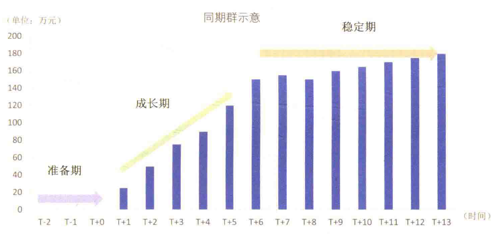{ width="800" }
</figure>

同期群分析法通常关注以下核心指标：

- 准备期长度：业务从启动到正式开展的时间。
- 成长期发展速度：业务的增长速度，按时间节点观察其扩展情况。
- 稳定期到来时间：业务何时进入稳定运营期。
- 稳定期表现：在稳定期内，业务表现是否符合预期。

判断标准也相对简单：准备期越短越好，成长期增长越快越好，越早达到稳定期越理想，稳定期表现越强越有利。

如果一个业务包含多个子项目，则可以对这些子项目进行同期群对比。例如，某人正在考察一项新技术推广计划，可以通过跟踪几个同时启动的试点项目，评估其表现。如图所示，在考察的五个试点项目中，只有一个项目能顺利进入稳定期。此时，项目的整体可行性已经能够得到初步判断。

<figure markdown="span">
  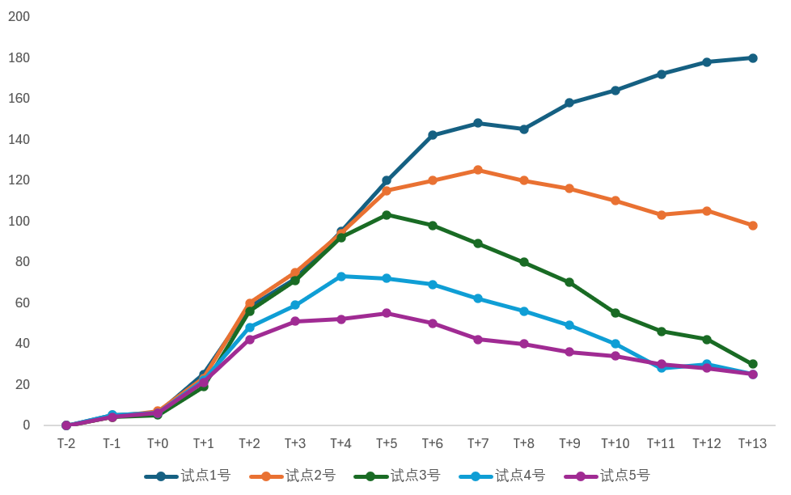{ width="800" }
</figure>

通过同期群分析法，即便未观察到一个完整的业务周期，也能做出及时决策：

- **早期表现不佳**：如果某个业务在初期发展不顺，很可能可以提前放弃，避免进一步投入。
- **早期表现突出**：如果某个业务在成长期表现出色，则可考虑尽早增加投入，扩大规模。
- **成功率分析**：如果多个子项目中仅有一个表现优异，则说明该业务整体成功率较低。

同期群分析法与生命周期分析法的思路类似。其实，如果将同期群观察时间延长至业务结束，就是完整的生命周期分析。两者的差别在于，同期群分析可以提前得出结论，有助于快速决策。这种快速决策方式虽伴随一定风险，但也能抓住先机。若等待完整的生命周期数据，可能错失市场机会，或其他竞争者已大量涌入。因此，同期群分析法是一种有效的工具，能够在业务尚未完全成熟时，帮助企业做出关键决策。

## 矩阵分析法

矩阵分析法是一种通过两个关键指标来确定判断标准的方法，操作非常直观。

- **第一步**：选择两个评价指标，并计算每个指标的平均值，作为衡量标准。
- **第二步**：将两个指标交叉组合，划分出4个象限，根据每个样本的指标表现，将其分布到不同象限中。
- **第三步**：根据两个指标的定义，对4个象限进行解读，并为每个样本分类。

当两个指标高度相关时，矩阵能有效地将数据分布在4个象限中，从而更清晰地揭示业务情况。

在数据分析中，常见且棘手的核心问题是：“到底指标达到多少才算好？”为此，内部讨论常常争论不休。矩阵分析法正是为解决这个问题而提出的，其逻辑非常简单：高于平均值的，就算好！

很多人可能觉得这个方法简单粗暴，但实际上，用平均值做判断标准有其优势：

1. **理解简单**：相比中位数、众数、四分位数，平均值更容易理解。
2. **计算便捷**：计算工具几乎都内置了计算平均值的功能。
3. **应用广泛**：例如，如果人均销售额是1万元，要达到100万元的业绩，只需配备100名销售即可。

相比之下，用中位数或众数来预测团队表现，往往难以给出明确的行动方案。因此，平均值的使用在很多场景下是合理且高效的。

然而，为什么还需要矩阵分析法呢？因为单一指标往往不能全面反映业务表现。举例来说，如果只考核销售业绩，销售人员可能会优先销售低利润、易出售的产品，而忽视高利润、难销售的产品。最终，公司虽然销售额上升了，但利润可能下降了。

因此，需要引入两个指标来综合评估，如：

- **销售业绩**
- **销售利润**

通过这两个指标的交叉对比，可以得出四种不同的情况和对应的业务建议（如下图）。将这两个指标分别置于矩阵的横轴和纵轴，就能构建一个清晰的矩阵图。

矩阵分析法的最大优势在于其直观性和易理解性。特别是当选择的两个指标是投入与产出的关系时，如“成本 vs. 收入”，矩阵可以帮助快速识别出关键问题，明确改进方向，极大减少“如何判断好坏”的困惑。

## 指标拆解法

## 漏斗分析法

## 相关分析法

## 标签分析法

## 对比分析法

## 多指标综合评估
