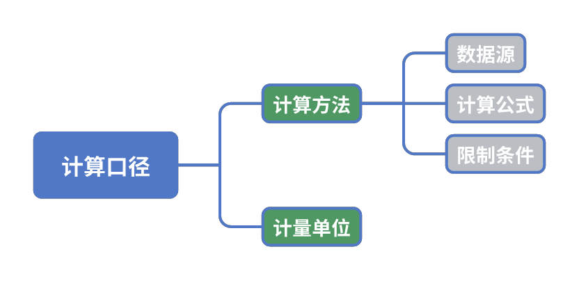

数据指标体系用于量化展示商业经营情况，也就是“是多少”。

## 什么是数据指标？

数据指标是帮助我们量化和理解事物的工具，用具体的数字来描述一些原本抽象的概念。在业务中，数据指标可以反映一个操作在某一段时间内的表现、规模或变化情况。

!!! Note "例子"

    - **口头描述：** 这个月我们销售情况不错。
    - **数据描述：** 这个月我们卖出了5000件产品。
    - **数据指标：** 本月产品销量。
    
    通过“本月产品销量”这个数据指标，我们能准确量化销售业绩，而不是模糊地说“销售不错”。这样更容易进行分析和比较。

数据指标，需要有清晰的定义。定义一个数据指标需要有三个要素：指标名称、统计时间、计算口径。

!!! Note "例子"

    - **指标名称：** 本月产品销量。
    - **统计时间：** 本月1号到31号。
    - **计算口径：** 统计销售系统中所有成功销售的订单数量，不包含退单数据。

计算口径，通常包含两个因素：计算方法和计量单位。计算方法又包括使用的数据源、计算公式、限制条件等多个因素。

<figure markdown="span">
  { width="600" }
</figure>

在数据分析中，数据源的选择会直接影响计算结果。一个常见的例子是“城市”。假设你在管理一家连锁店，你可能会遇到以下情况：城市信息可以来自多个不同的数据源，比如：①客户的居住城市；②客户的送货地址城市；③会员卡注册时填写的城市；④通过客户手机号归属地确定的城市等。不同的数据源适合不同的业务场景使用，但有时这些数据来源可能都会出现。这时，我们必须明确规定使用哪个数据源，或者在数据不一致时如何处理。

另一个重要部分是计算公式。尤其是当我们定义一些综合性指标时，比如“顾客忠诚指数”之类的复合指标，计算公式必须十分明确。有时，计算公式里涉及到分母为零的情况，这会影响最终结果，所以我们必须在定义公式时考虑这种情况，并制定处理方式。

限制条件也是数据指标中的关键。例如，零售门店常用的“活跃顾客数”指标，每个公司的定义可能不同。比如，一些公司会定义“在本月内至少有一次消费”的客户为活跃顾客；另一些公司可能会更严格地要求“在本月内有多次购物”的客户才算活跃；还有的公司则会结合其他行为，例如参与会员活动、使用优惠券等。这些不同的标准就是我们常说的“限制条件”。就像在一些比赛中，评委打分时会“去掉一个最高分，去掉一个最低分”，这也是限制条件的一部分。

此外，计量单位的选择也非常重要。例如，店铺面积的单位是平方米(m²)，如果你误用了平方英尺或其他单位，结果可能会偏差很大。类似地，计算某种商品的销量时，使用“件”还是“箱”这样的计量单位会直接影响你的分析结果。

在构建数据体系的初期，口径争议是常见的，特别是当企业还没有统一的指标库时。因此，尽早建立统一的指标库，并定义清晰的规则来处理指标口径的变更，是非常关键的工作。通过这样做，能够确保数据在不同时间段、不同业务部门之间保持一致，最终让决策更加可靠和高效。

!!! Question "思考题"

    请找出一个你在工作中常用的数据指标，定义它的三个要素。然后，询问你的同事，他们是如何定义这三个要素的。你们的定义一致吗？

要得到一个数据指标，我们需要考虑三个关键问题：**对象**、**哪个方面**、**是否有数据**。

这个过程类似于我们在日常生活中做出判断的方式。举个简单的例子，假设我们想要了解某家店的顾客满意度，我们需要明确以下几个方面：

1. **对象**
我们首先要明确评估的对象是谁。在这个例子中，评估对象是那家店的顾客。我们想知道这些顾客对店铺服务的感觉是否满意。

1. **哪个方面**
接着，我们要确定评估的具体方面。顾客满意度可以从很多角度去衡量，比如：店铺的服务态度、商品的质量、价格的合理性等。在这个例子中，我们选择“服务态度”作为评估的重点方面。

1. **是否有数据**
最后，我们需要思考能否通过数据来量化这个方面。在“服务态度”这一点上，我们可以通过顾客填写的满意度问卷获取数据，比如问卷中“对服务态度的满意度打分”，这个打分就是我们可以用来衡量的具体数据。

1. **扩展：同一对象，不同角度的衡量**
就像不同的人看问题的角度不同，数据指标的选择也可以有很多种。假设我和我的朋友去同一家店，他可能更在意商品的价格，而我更关心服务质量。这时，我们对这家店的评价就会基于不同的数据指标。我的指标可能是“服务满意度评分”，而他的指标则可能是“平均商品价格”。

为了定义一个有效的数据指标，首先要明确我们在衡量什么（对象），再决定用哪个角度（方面）去评估，最后看看是否有足够的数字数据来支持这种评估。这样我们才能更科学、准确地得出结论。不同的业务指标就像我们在生活中做出判断一样，基于我们关心的对象和方面，并且要确保这些方面能通过数据进行量化。通过明确对象、细化关注的方面，再找到合适的数据来源，我们就能建立有效的数据指标，为业务决策提供支撑。不同的业务场景下，我们的对象和衡量标准会有所不同，但思路是相通的。

!!! Example "小测验（单选题）"

<?quiz?>
question: 1. 数据指标的主要作用是什么？
answer: 定性地描述业务表现
answer-correct: 定量地量化和理解事物
answer: 提供主观判断标准
answer: 对事物进行感性描述
content:
正确答案： 定量地量化和理解事物。数据指标的核心目的是通过数字量化来帮助我们理解事物，而不是通过主观或感性的方式来描述事物。
<?/quiz?>

<?quiz?>
question: 2. 要建立一个有效的数据指标，首先要考虑哪一点？
answer: 数据的来源
answer: 指标名称
answer-correct: 评估对象
answer: 统计时间
content:
正确答案： 评估对象。在建立一个数据指标时，第一步是确定我们要衡量的对象，只有明确对象之后，才能选择合适的数据和统计方式。
<?/quiz?>

<?quiz?>
question: 3. 假设要衡量顾客满意度，哪项内容不属于评估方面？
answer: 商品质量
answer: 服务态度
answer: 商品价格
answer-correct: 营业额
content:
正确答案： 营业额。顾客满意度通常评估的是服务态度、商品质量、价格合理性等，而营业额反映的是销售业绩，与顾客满意度无直接关系。
<?/quiz?>

???+ Quote

    为什么刷牙不能坚持认真刷，为什么在跑步机上却能坚持跑步。有许多事情不容易做好和不被重视的原因就是因为没有指标系统。比如，如果健康有准确方便度量的指标，那么大家的身体素质一定会提高。

    但是指标不见得好提炼，提炼指标的过程，本身是分解事物特征的过程，而且指标要常测量。比如：当我今天发现眼镜度数上升100度的时候，才意识到用眼过度了，才意识到在手机上看书是非常不恰当的行为。

    ——张一鸣，字节跳动创始人

## 什么是指标体系？

单一的指标往往很难全面地展现某个现象，因此我们通常需要多个指标从不同角度去描述，才能让情况更加清晰。

比如说，你想评估某个商品的销售情况，单看“销量”这个指标不够全面，因为销量可能受很多因素影响。为了更全面地了解，你还需要结合其他指标，比如“退货率”和“毛利率”，这样你才能知道商品卖得好不好、退得多不多，以及是否赚钱。

不仅要看多个现象，还要看现象之间的关系。打个比方，想要知道顾客进店和买东西之间的联系，你可以用两个指标：一个是“顾客到店人数”，一个是“商品销售数量”。但这两个数字本身并不告诉你太多，只有通过“转化率”（即有多少顾客实际买了东西），你才能真正理解店铺的经营效果。所以，指标不仅要描述现象，还要描述现象之间的关联。

指标体系不是简单的平面结构，也不是直线，它更像是一个有层次的网络。不同的指标之间是互相影响的，有些指标是并列的，有些指标可以拆解为更细的部分，还有些指标是上下游相互连接的。这样，你在关注某个指标的时候，不仅仅是看它本身，还要考虑它对其他指标的影响。

在实际操作中，指标体系通常有三种主要的关系：

1. **并列式指标体系**：几个指标是并列的，它们独立存在但一起描述业务的不同方面。比如，“业绩”等于“客户数”。

2. **总分式指标体系**：一个总指标可以拆分为多个小指标。比如“整体销售额”可以细分为“线上销售”和“线下销售”两部分。

3. **流程式指标体系**：这些指标是有前后顺序的，像业务流程一样相互连接。例如，“顾客下单率”可以和“支付完成率”共同反映顾客的购买行为从意图到实际支付的过程、“发货速度”和“配送时效”则描述了订单处理从仓库发货到顾客收货的整个物流过程，最后“退货率”反映了顾客对整个购买流程（包括商品和服务）的满意度。这个流程式指标体系衡量了从下单到发货，再到退货整个流程的效率。

这样一个结构化的指标体系，帮助我们避免只盯着一个指标看问题，而是从多个角度进行分析，确保每个决策都能考虑到更多的因素，避免“头痛医头、脚痛医脚”的局面。通过这种方式，你能更好地掌握业务全貌，做出更准确的判断。

!!! Question "思考题"

    请回顾一下你最近的工作报告，看看里面涉及到哪些指标。仔细思考一下，它们之间是否有相互关联？理解这些指标的相互关系后，思考是否有机会重新整理它们的顺序，使整个报告更加逻辑清晰。通过重新排列指标，你可以让报告更具条理性，读者也能更直观地看到数据背后的业务表现和原因，从而做出更有针对性的调整和决策。

要建立一个有效的数据指标体系，我们可以按照以下几个步骤来进行：

1. **锁定观察对象：** 首先，明确你想要研究的核心对象是什么。这个对象可以是公司运营的某个部分，比如销售、库存、客户服务等。锁定对象的过程是整个数据分析的基础，只有确定了正确的观察对象，才能确保后续的分析具有针对性和意义。

2. **明确目标：** 接下来，你需要清楚地知道你想从这个对象身上了解什么方面。是想评估销售的增长趋势？还是分析库存的周转效率？明确目标可以帮助你聚焦于具体的问题或机会，避免数据的杂乱无章。

3. **收集相关指标，确认有数据可以采集：** 根据你的目标，找到相关的衡量指标，并确保这些指标背后有可用的数据来源。例如，如果你的目标是评估销售趋势，你可能需要“本月销售额”、“订单数量”等指标。如果缺乏数据，必须找到其他替代的指标或考虑如何改进数据采集流程。

4. **组织指标：并列、总分、流程关系：** 收集到足够的指标后，需要对它们进行合理的组织和分类。通过这种结构化的整理，你可以使得指标之间的关系更加清晰，便于更深入的分析。

5. **进行观察，得出结论：** 最后，基于已经组织好的指标，进行持续的数据观察，提取出有价值的洞见。根据这些数据，你可以得出关于业务表现的结论，判断哪些方面做得好，哪些方面需要改进，从而为后续的决策提供依据。

通过这个流程，你将建立一个能够有效反映业务情况的指标体系，不仅有助于全面分析，还能让你在关键时刻做出数据驱动的决策。

!!! Example "小测验（单选题）"

<?quiz?>
question: 1. 为什么单一指标通常难以全面展现一个现象？
answer: 因为单一指标太复杂
answer-correct: 因为单一指标往往只描述了现象的一个方面
answer: 因为数据不够准确
answer: 因为指标没有定义清楚
content:
正确答案： 因为单一指标往往只描述了现象的一个方面。单一指标通常只能从一个角度描述现象，为了全面了解情况，往往需要结合多个不同的指标。
<?/quiz?>

<?quiz?>
question: 2. 并列式指标体系通常用于：
answer-correct: 描述业务不同方面的独立现象
answer: 拆分总指标
answer: 测量业务流程中的各个环节
answer: 测量单一现象的不同角度
content:
正确答案： 描述业务不同方面的独立现象。并列式指标体系是用来描述业务的不同方面，通常是独立存在的。
<?/quiz?>

<?quiz?>
question: 3. 流程式指标体系最常用于：
answer: 评估员工的绩效
answer: 描述不同现象之间的关系
answer-correct: 衡量业务过程中的各个阶段
answer: 分析顾客满意度
content:
正确答案： 衡量业务过程中的各个阶段。流程式指标体系是用来描述业务流程的每个节点，通常是按顺序存在的。
<?/quiz?>

<?quiz?>
question: 4. 为什么在指标体系中不仅要描述现象，还要描述现象之间的关系？
answer-correct: 因为关系可以提供更全面的分析，揭示业务运作的内在逻辑
answer: 因为关系能让指标更加复杂
answer: 因为没有关系的指标无法使用
answer: 因为关系可以减少数据量
content:
正确答案： 因为关系可以提供更全面的分析，揭示业务运作的内在逻辑。描述现象之间的关系可以帮助我们更深入地理解业务运作，揭示指标背后的内在逻辑。
<?/quiz?>

## 提高数据质量

建立数据指标的关键，不在于建立指标的人有多么高深的思维，而在于数据质量。数据质量是由数据采集、数据清洗、数据存储、数据管理规范等工作组成的。这些工作除了负责数据开发的工程师可以看明白，普通人既看不懂也不理解，但它们确实是数据分析成败的关键。

举个简单的例子，一个小超市的老板在收款时有三种方式：

- 方式一：顾客直接给现金，老板把钱放进抽屉。
- 方式二：老板用POS机扫商品条码，然后顾客用微信付款。
- 方式三：顾客报会员卡号，老板输入后再扫商品条码并完成支付。
  
这样会留下3种完全不同的数据记录结果：

- 钱直接放在抽屉里： 没有商品记录，收入不明，老板也不知道自己抽屉里有多少钱，或者谁拿了多少。
- 微信扫码付款：商品和收入记录在POS机里，但无法知道是谁购买了商品。
- 输入会员卡号再扫码：可以记录商品、收入和购买者的信息，并且能分析客户行为。

这3种方式记录的数据质量是完全不同的。

如果只是简单地把钱放在抽屉里，那么这种数据记录完全无质量可言。根本分不清楚抽屉里的钱是卖哪些商品得来的，是上个月剩下的钱还是这个月新赚的钱。至于老板临时从抽屉里拿走多少钱，也一无所知。

如果有POS机记录，那么至少能区分出来哪些商品被买走了。这样可以对商品销售情况进行分析，在盘点商品的时候也有一份记录数据可以对照。如果有微信记录，则至少能区分出来哪些是营业收入，哪些是自己私人的零用钱，但仍无法对谁购买了商品进行分析。

如果有客户的手机号，就有了一个ID对客户进行识别，就能分析谁买了哪件商品，就能做很多其他的工作了。

- 复购：客户买了一袋米，按时间推算，应该差不多食用完了，可以问客户需不需要再购买。
- 交叉销售：客户买了拖把、扫帚，推测客户在大扫除，推荐客户买清洁剂。
- 增量销售：客户买了5瓶啤酒，提醒客户，买6送1。
- 增值服务：客户买了5瓶啤酒，提醒客户，一次买1箱可以直接送货上门。
- 新品推荐：客户之前常买的护手霜出新品了，很好用还有赠品。

大部分营销策略都是基于这些数据分析成果而设计的，越精细的策略，越需要精细的数据记录与深入的数据分析。

然而，很多小店老板不会做到这一点。通常，数据采集的混乱导致他们对自己的销售、库存甚至利润都一无所知。

那么，大型连锁超市是否就更好一些呢？完全不是！读者可以回忆一下自己去大商场或连锁店购物时的经历。店员们会要求客户出示会员卡或手机号，可真正出示的客户能有多少？根据一些BI企业对交易数据的统计，大概只有10%的订单能关联到一个会员ID，剩下90%的订单都是收银员随手略过的。可以说，数据采集问题，不分企业大小，都是非常让人头疼的问题。

这种现状导致的结果是即使是简单的一个“销售收入”指标，都很难进行准确的统计，更不用说以下数据了。

- 客户的性别、年龄等这些隐私数据。
- 客户对商品的喜好、关注点这种态度数据。
- 客户来了多少次、看了哪些商品、没看哪些商品等这种行为数据。

同理，一个看似简单的“开店成本”指标，也很难进行准确的统计。因为成本不像收入能立刻记录下来。

- 资金成本：常常表现为每月周转资金的贷款成本，计算方法复杂。
- 进货成本：经常受赊销、分期付款、上游厂商优惠等影响，还有下游商家“窜货”等行为，发生时间不固定，计算方法复杂。
- 库存成本：仓库并非时时盘点，经常会发生库存损耗、商品过期也不知道的情况。

因此，成本会比收入更难精确到每天进行统计。

大型企业可以用一些技术手段来提高数据的准确性，但仍然无法做到完全精确。比如，对于一个电商平台，用户的交易完全在平台上进行。此时，可以为每一个用户建立一个ID,记录用户在平台上的浏览过程，记录交易结果和交易订单情况。这样看起来有较完备的记录。但这些记录也只是“较为完备”而已，仍然有大量问题：

- 用户不提供真实性别、年龄等基本信息。
- 商家为了提升店铺权重，故意刷单，人为制造好评。
- 用户为了套取平台优惠，用好几个手机号注册，领新人福利。
- 浏览行为需要埋点采集，为了赶上线进度，埋点出问题/压根没做。

即使数据采集回来，也会有各种问题导致数据无法使用，比如：

- 商品信息表/活动信息表缺乏维护，里边混杂了各种错误、混乱的信息。
- 公司各个部门之间数据不互通，根本不知道其他部门在做什么。
- 公司缺少统一的数据规范，同一个指标，不同部门的计算方法不一样。

所以，“大公司有很多很准确的大数据”这样的想法并不正确。数据采集、筛选、管理本身是一个艰苦的工作，并且对业务而言没有直接的影响，所以很容易被忽视，在各行各业这是普遍的情况。因此，在真正做分析时，不能寄希望于“我们的程序员很强大，我们的数据完全精准，我们的数据很全面”。

在我们的分析过程中，数据质量问题往往被忽视，但它对业务决策的影响是非常巨大的。业务部门在日常工作中收集的数据可能存在缺失、不准确甚至不一致的情况，这将直接影响到分析结果的可靠性和有效性。通过我们的观察，很多问题其实源于数据采集的过程，比如手工记录、未充分利用现有系统等。

要解决这些问题，我们建议业务部门采取以下措施：

1. **标准化数据采集流程**：确保每一步业务操作都能准确地记录相关数据，减少人为因素对数据准确性的影响。
   
2. **提升系统使用率**：鼓励员工在工作过程中，尽可能多地收集相关数据，提升系统使用率，积极反馈目前系统中无法记录的数据内容，以便后续系统升级与数据分析。

3. **重视反馈与培训**：通过定期反馈，让员工了解他们的数据采集工作对整体业务分析的重要性，并为他们提供必要的培训，帮助他们掌握高效、规范的数据记录方式。

通过采取这些措施，业务部门不仅能够提高日常数据的质量，还能在决策时获得更为精准、可靠的分析结果。这将为整体业务发展提供强有力的数据支撑，推动公司更加有效地进行运营优化。
