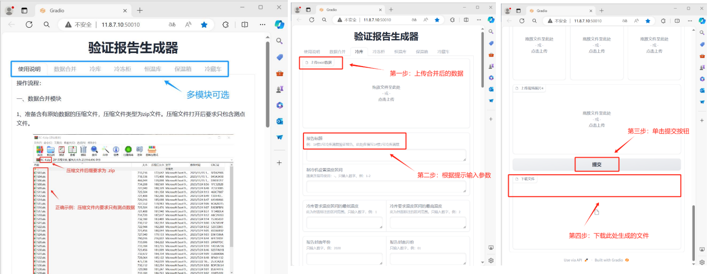
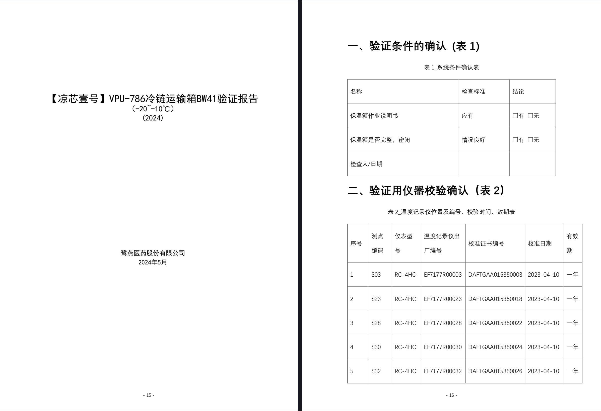
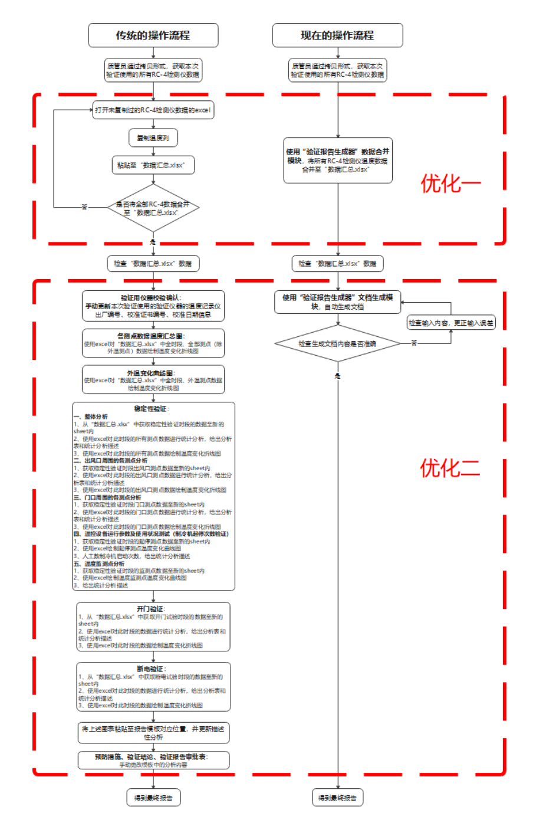

根据《药品经营质量管理规范》的要求，公司每年需要对包括冷库、冷藏车、 冷藏箱、保温箱以及温湿度自动监测系统（以下简称监测系统）在内的设备进行严格验证。这些验证工作旨在确保所有设施和系统符合设计标准，并能在储存和运输过程中安全、有效地运行，从而保障冷藏、冷冻药品的质量安全。

由于公司规模较大，涉及的设施和设备众多，目前公司拥有 ^^5个仓库^^、^^4个冷冻柜^^、^^5辆冷藏车^^ 和 ^^98个保温箱^^。每年，我们需要投入大量时间和人力物力来完成这些设施和设备的验证工作，包括获取测试数据、分析结果以及撰写详细的验证报告。这一过程不仅耗时耗力，还需要投入大量资源来确保验证的准确性和全面性。

项目的主要目的是通过自动化工具简化验证报告的编写过程，将传统上繁琐耗时的手动绘图、制表和描述性统计分析工作，转变为更为高效的数字化处理。

<figure markdown="span">
  { width="800" }
  <figcaption>验证报告生成器界面展示</figcaption>
</figure>

<figure markdown="span">
  { width="800" }
  <figcaption>上传数据到自动化验证报告生成器后生成的文档</figcaption>
</figure>

<figure markdown="span">
  { width="800" }
  <figcaption>流程优化对比</figcaption>
</figure>

## 1. 业务流程的梳理与分析

在项目实施的初期，我们与公司的质管人员进行了深入的沟通，并多次在现场观察他们的工作流程，同时倾听他们的需求和痛点。通过几天的学习和讨论，我们总结了以下几个关键要点，以便为项目设计更高效的解决方案：

- **业务流程：** 每个模块的报告需求略有不同，但报告的格式和内容在各个模块之间相对一致。这为我们设计标准化的自动化报告生成工具提供了基础，同时也简化了流程优化的复杂性。
- **技术能力：** 管人员需要一个可视化界面，能够方便地引导他们上传设备的测试数据和文档参数。该界面应当具备直观的操作体验，并能自动根据既定的格式生成符合规范的Word文档，确保质管员无需手动编写繁琐的报告内容。
- **成本效益：** 目前，质管人员撰写每份验证报告需要耗费大量时间，若外部公司进行验证的费用约为每年6万元。通过开发并应用自动化报告生成器，质管员不仅能够大幅减少手动操作的时间，还能确保报告的准确性达到100%。自动化工具不仅减少了人为错误的风险，还让质管人员能够专注于更具策略性的质量管理工作，提升整体工作效率。

## 2. 设计

在设计过程中，我们精心规划了项目的整体架构和工作流程，确保从技术到功能的每个环节都能够顺利实现。以下是我们在设计阶段的几个重要决策和工作进展：

- **项目架构与流程设计：** 首先，我们为整个项目设计了清晰的架构，确定了各个模块的职责和数据流。通过定义核心流程，我们确保了后续开发工作的方向明确，并且每个模块之间能够高效地协同工作。
- **技术栈选择：** 我们经过讨论和技术调研，最终确定使用Quarto作为后端文档生成工具，借助其强大的模板和格式化功能来满足文档生成的需求。同时，选用了Gradio作为前后端交互的框架，使得用户界面和后台逻辑的连接更加简洁、高效。
- **框架搭建：** 在明确技术栈后，我们完成了项目的框架搭建，确保前后端能够顺畅交互。这个过程包括接口设计、数据传输逻辑的实现等基础工作。
- **模块开发与功能实现：** 开发了基本的功能模块，包括数据采集、处理以及文档生成功能。经过初步测试，确保了系统能够正常运行，基本功能可以使用。

这些步骤为项目后续的扩展和优化打下了坚实的基础，也使得质管工作从传统的手动编写报告转向更加智能化的自动化流程。

## 3. 开发

在开发阶段，我们根据项目需求，逐步在现有框架的基础上开发了新的模块，以满足各个环节和不同目标的需求。整个开发过程主要围绕以下几个方面进行：

- **模块化设计：** 项目采用模块化开发思路，针对不同的业务场景和需求，开发了冷库、冷冻柜、恒温库、保温箱、冷藏车等13个模块。这些模块的功能和特点根据特定的冷链管理需求进行了区分和优化。
- **日志记录：** 为了监控系统运行的稳定性和故障排查，我们加入了日志记录功能，能够追踪和分析每个模块的运行和使用状况。

## 4. 测试

在测试阶段，我们遵循严格的测试流程，确保项目质量符合要求。以下是具体的工作要点：

- **制定测试计划并执行：** 根据项目需求，编制详细的测试计划，涵盖各模块的功能、性能、和交互测试。我们逐步执行计划，确保每个模块按照预期运作。每次测试的结果都被仔细记录并进行评估，以发现潜在问题并验证解决方案的有效性。及时收集用户和监管机构的反馈，经过整理、分析后，迅速制定并实施优化措施，确保用户需求得到迅速响应。
- **模块结构优化：** 在初期测试中，我们对原有的13个模块进行更新和优化，最终将其简化为12个模块。通过模块的合并和新增，进一步优化了项目结构，提高了系统的整体性能。
- **应对监管机构的反馈：** 在测试过程中，监管机构老师提出了新的问题和建议，我们迅速对现有模块进行了大幅调整，新增了两个模块，并对四个模块进行了深入的修改。
- **数据合并模块开发：** 为了简化数据预处理工作，我们开发了数据合并模块，提升了整体的处理效率。

这一阶段确保了项目的稳定性和功能的完善性，准备进入更广泛的用户使用阶段。

## 5. 部署与维护

在部署和维护阶段，我们向业务部门交付了最终成果物，并进行验收和确认。然而，由于监管机构对业务要求的不断提升，我们预见到未来仍可能会有新的更新需求，因此“验证报告生成器”需要进行长期的维护和迭代优化。维护工作涵盖以下几个重要方面：

- **故障修复：** 工具在运行过程中可能会遇到各种错误和故障。我们的首要任务是确保快速响应并解决这些问题，保证工具的稳定性。及时的故障修复有助于避免业务中断，提高用户体验。
- **性能优化：** 在系统运行的过程中，我们会持续监控工具的性能，识别可能存在的性能瓶颈。一旦发现瓶颈，将进行深入分析并采取针对性的优化措施，提升工具的响应速度和数据处理能力，确保其能够应对不断增长的业务需求。
- **软件升级：** 随着技术的不断进步，我们会适时升级项目中使用的框架、库和工具。通过版本升级，不仅能利用最新功能，提升工具的性能和安全性，还能确保项目与最新技术保持兼容。
- **环境管理：** 维护服务器及工具的运行环境是保障项目长期稳定运行的基础。我们将定期清理过时数据，优化服务器资源利用，确保环境健康运行，并根据业务扩展需求及时扩展系统能力。
- **用户支持：** 为业务部门提供持续的技术支持和培训是维护工作的重要内容之一。我们会及时解答用户问题，帮助其熟悉工具的功能，并根据用户反馈进行功能调整或优化，确保工具能够真正满足业务需求。
- **文档更新：** 项目文档的及时更新至关重要，包括技术文档、操作指南等。我们将确保文档内容准确无误，随着工具的演进和功能更新，及时更新文档，便于用户查阅和参考。

综上所述，维护工作是一个持续的、综合性的过程，旨在确保工具在满足现有业务需求的同时，具备长期稳定和高效的运行能力。通过不断优化和更新，我们将保持“验证报告生成器”的灵活性和可靠性，帮助业务部门实现高效的质量管理。

## 6. 衡量结果

根据质量管理人员的评估，“验证报告生成器”在各个方面显著提升了工作效率，具体如下：

- **时间节省：** 手工使用模板替换测点数据生成一份报告大约需要 30 分钟。使用“验证报告生成器”生成同样的报告耗时大大减少，制作一份报告的时间通常在 30 秒以内，平均大约 10 秒左右。整个流程中，生成报告所需的时间主要取决于质量管理人员输入参数的速度。开发人员测试结果显示，输入测点数据大约需要 5 分钟。综合来看，与手工操作相比，使用报告生成器后，报告撰写的总时间减少了 80% 至 85%。
- **效率提升：** 通过自动化生成报告，质管人员能够将更多时间集中在数据分析和质量改进等核心工作上，而不再消耗大量时间在繁琐的报告生成操作上。自动化系统确保了报告生成的速度和准确性，减少了人为操作错误，提升了报告的总体质量。
- **长期成本效益：**
    * 大幅减少了每份报告的处理时间，降低了人力成本，减少了外包报告生成的需求，为企业节约了大量的运营费用。
    * 减少了质管人员的重复性低价值工作，使他们能够专注于更具战略意义的质量控制与优化，提升了整体业务效益。

通过以上衡量标准，“验证报告生成器”的引入不仅显著缩短了报告撰写时间，还提升了整体工作的效率和准确性，同时为企业节省了运营成本。
